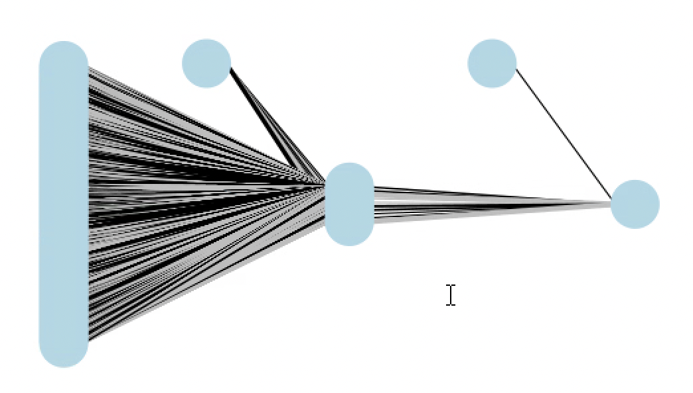
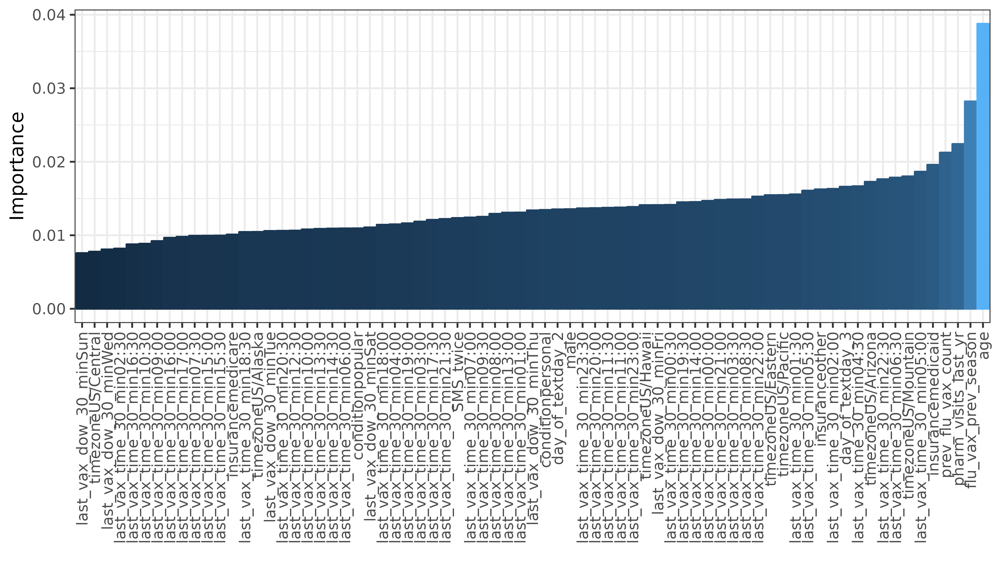

```{r setup, include=FALSE}
knitr::opts_chunk$set(fig.height=4, fig.width=6, warning = F)
if (!require("pacman")) install.packages("pacman")
pacman::p_load(pander)
```

\newpage

\textcolor{red}{\textbf{CONFIDENTIAL - PLEASE DO NOT SHARE}}

This report uses data in partnership with a large pharmacy in the United States. Since the data is subject to HIPPA privacy requirements, all the data for the analysis was conducted on a separate secure server, in accordance with the contractual obligations with the pharmacy partner. 

Since there are restrictions on how this data may be used, we ask that you do not share this report with anyone outside of grading purposes. 

\newpage

# Executive Summary (1 page)

## Introduction

Even though vaccines are a cost-effective method for decreasing mortality, morbidity, and healthcare expenses[^1], promoting recommended annual vaccinations against dangerous diseases remains a major public health challenge. For example, for the 2022-23 flu season, 53.1% of the U.S. population choose not to receive the recommended influenza vaccine even though such vaccines can prevent subsequent illnesses, hospitalizations, and deaths[^2].

In collaboration with a large U.S. pharmacy chain, we collected a 1-million-person dataset where text messages were sent to patients to encourage a flu vaccination. Using this data set, we compare the performance of different predictive models to test how accurately we can identify patients who are likely to be vaccinated for the flu 30 days after receiving a text message. 

## Study Goal

The primary objective of this study was to test if model choice impacts classification accuracy on patients' likelihood of receiving a flu vaccination within 30 days. We also aim to benchmark the predictive accuracy of the best model in predicting flu vaccination uptake, using information that is commonly available to pharmacies and providers. These results have implications for both policymakers, healthcare systems, and health providers who may want to predict vaccination uptake to inform planning and resource allocation.

## Data Description

The dataset, obtained through our pharmacy partner, includes 1 million patients who received a text message flu vaccination reminder text message. The data captures patient demographics, vaccination history, text message reminder details, and pharmacy visit information. The primary outcome variable is flu vaccination within 30 days of receiving the reminder.

## Methodology

We developed and evaluated six predictive models: OLS with Classifier, Logistic Regression, Relaxed Lasso with Logit, Relaxed Lasso with OLS, Random Forest, and Neural Network. Model performance was assessed using metrics such as area under the ROC curve (AUC), misclassification error, and confusion matrices.

Exploratory data analysis revealed associations between vaccination uptake and variables such as age, previous vaccination history, pharmacy visit frequency, and Medicare insurance status. These insights informed feature selection for the predictive models.

## Results

The OLS with Classifier and Neural Network models achieved the highest AUC (0.763 and 0.764, respectively) and lowest misclassification error (0.118 for both) on the test set. However, the Neural Network predicted no vaccinations for all patients, indicating potential limitations.

The Logistic Regression, Relaxed Lasso with Logit, Relaxed Lasso with OLS, and Random Forest models achieved AUCs ranging from 0.740 to 0.762 and misclassification errors between 0.118 and 0.120.

While the OLS with Classifier and Neural Network had the best performance metrics, the OLS with Classifier is preferred due to its interpretability and lower false positive rate, which is crucial for informing vaccine stocking decisions.

\newpage


# Detailed Analyses
## Description of Data

The dataset used in this study was obtained through a partnership with a large nationwide pharmacy chain, where text messages were sent to patients to encourage flu vaccinations. The text messages were sent in September 2023 during the start of the 2022-2023 flu vaccine season to patients who (1) were over the age of 18, (2) opted in to pharmacy communications, (3) received at least one vaccine at the pharmacy chain in the past. The primary outcome of interest being whether a patient received a flu vaccination within 30 days of receiving the reminder (`flu_vax_30_days`). 

The content of the text message reminder (`condition`) was varied to test the effectiveness of different messaging strategies. for example, one text message encouraged patients to get vaccinated at a *popular* time, while others encouraged patients to get vaccinated at a *personalized* time consistent with the time and day of week of thier last vaccination.  To assess the potential impact of multiple reminders, some patients received a second message (`SMS_twice`). Lastly, the day the message was sent (`day_of_text`) was also recorded.

In addition to variables describing the text message, the dataset captures each patient's vaccination history. This includes whether they received a flu shot in the previous season (`flu_vax_previous_season`) and the total number of flu vaccinations they had received in the past 8 years (`prev_flu_vax_count`).

The dataset also includes demographic variables such as age (`age`), gender (`male`, `female`), and insurance type (`insurance`). These factors may influence a patient's likelihood of receiving a flu vaccination and are important to consider in the analysis.

To account for potential differences in patient behavior based on their level of engagement with the pharmacy, the dataset includes the number of visits that involved at least one prescription pickup or transaction in the past year (`pharm_visits_last_yr`).

Lastly, the study captures temporal patterns in vaccination behavior by recording the day of the week (`last_vax_dow_30_min`) and time (`last_vax_time_30_min`) of the patient's last vaccination. The patient's timezone (`timezone`) is also included as a general indicator of location (as any data that may identify a given participant is protected and cannot be shared).

This dataset combines intervention-specific variables with patient characteristics and historical behaviors. We aim to gain insights into the effectiveness of text message reminders in promoting flu vaccination uptake. 

\textbf{Data variables}:

- `flu_vax_30_days`: whether the patient received a flu vaccination within 30 days of treatment
- `condition`: different text message content sent to the patient to encourage vaccination
- `day_of_text`: which day the text message was sent (1 of 3 days in September 2023)
- `SMS_twice`: whether the patient received a reminder message
- `flu_vax_previous_season`: whether the patient received a flu vaccination in the previous season
- `age`: the patient's age
- `male`: whether the patient is male
- `female`: whether the patient is female (indicator ommitted)
- `insurance`: the type of insurance that a patient has (e.g., Medicare, Medicaid, etc.)
- `prev_flu_vax_count`: the number of flu vaccinations the patient has received in the past 8 years
- `pharm_visits_last_yr`: the number of visits to the partner pharmacy in the last year where the patient made at least one pickup or transaction
- `last_vax_dow_30_min`: the day of week of the patient's last vaccination (rounded to the last 30 minutes)
- `last_vax_time_30_min`: the time of the patient's last vaccination (rounded to the last 30 minutes)
- `timezone`: the patient's timezone

\newpage


## Exploratory Data Analysis

The exploratory data analysis section presents several visualizations that provide insights into the relationships between key variables and flu vaccination uptake within 30 days of receiving the text message reminder.

Figure 1 shows a Spearman correlation plot of the key variables. The plot reveals strong positive monotonic correlations between the outcome variable `flu_vax_30_days` and several predictors, including `prev_flu_vax_count`, `flu_vax_prev_season`, `age`, and `pharm_visits_last_yr` (Figure 1 - first row). This suggests that patients who have received more flu vaccinations in the past, got vaccinated in the previous season, are older, and visit the pharmacy more frequently are more likely to get vaccinated within 30 days of the reminder.

{width=100%}

\newpage

Figures 2 and 3 present boxplots comparing the distribution of age and the number of past flu shots between patients who did and did not get vaccinated within 30 days. In both cases, the mean values for vaccinated patients are higher, indicating that vaccinated patients tend to be older and have received more flu shots in the past compared to unvaccinated patients.

{width=75%}

{width=75%}

Figures 4 and 5 display mosaic plots examining the relationship between Medicare insurance and flu vaccination within 30 days. The plots show that a higher proportion of patients with Medicare insurance get vaccinated compared to those without Medicare. This suggests that insurance type, specifically Medicare coverage, may influence a patient's likelihood of getting a flu shot after receiving the reminder.

{width=80%}

{width=80%}

\newpage

Finally, Figure 6 presents a heatmap of the last vaccination times for patients. The heatmap reveals patterns in the timing of past vaccinations, with higher vaccination rates on Monday, Wednesday, and Friday compared to other weekdays and weekends. Vaccination times also clustered in the late morning (11am) and early afternoon hour (3pm). If there is a pattern or routine to how and when patients get vaccinated, this information could be useful to predict the likelihood of subsequent vaccination thirty days after receiving a text message.

{width=100%}

## Predictive Modeling

To predict whether a patient will receive a flu vaccination within 30 days of the text message reminder, we developed and evaluated six different predictive models: OLS with Classifier, Logistic Regression, Relaxed Lasso with Logit, Relaxed Lasso with OLS, Random Forest, and Neural Network.

The OLS with Classifier and Logistic Regression models serve as our baseline approaches, using linear and logistic regression techniques, respectively. The Relaxed Lasso models (with Logit and OLS) extend these approaches by incorporating feature selection to identify the most informative predictors.

We also explore two machine learning models: Random Forest and Neural Network. The Random Forest model allows for a more flexible, non-linear relationship between the predictors and the outcome, while the Neural Network model has the potential to capture complex patterns in the data.

For each model, we evaluate its performance using metrics such as the area under the ROC curve (AUC) and misclassification error, as well as examining the confusion matrix to assess the model's ability to correctly predict vaccinated and unvaccinated patients. Our dataset was divided into three partitions: a 60% training set, a 20% testing set, and a 20% holdout validation set. The testing set was used to select the best-performing model and the validation set was used to evaluate the final model out-of-sample performance. 

By comparing the performance of these six models, we aim to identify the approach that best predicts flu vaccination uptake within 30 days of the text message reminder.

### OLS w/ Classifier

```{r, include = F}
confusion_table <- structure(c(180113L, 0L, 24031L, 4L), dim = c(2L, 2L), dimnames = list(
Predicted = c("Predicted - 0", "Predicted - 1"), Actual = c("Actual - 0", "Actual - 1")), class = "table")

auc_ols <- 0.763

misspecification_error <- 0.117713619530929

# Anova Table (Type II tests)
# 
# Response: flu_vax_30_days
#                      Sum Sq     Df    F value                Pr(>F)    
# condition                 1      2     4.8966              0.007472 ** 
# day_of_text               1      2     6.3605              0.001729 ** 
# SMS_twice                 3      1    33.6368        0.000000006646 ***
# flu_vax_prev_season     844      1  9149.6384 < 0.00000000000000022 ***
# age                     139      1  1508.5663 < 0.00000000000000022 ***
# male                      0      1     4.0490              0.044197 *  
# insurance                58      3   208.8539 < 0.00000000000000022 ***
# prev_flu_vax_count     1224      1 13257.6052 < 0.00000000000000022 ***
# pharm_visits_last_yr     95      1  1032.1227 < 0.00000000000000022 ***
# last_vax_dow_30_min       4      6     7.3246        0.000000075770 ***
# last_vax_time_30_min     34     47     7.9275 < 0.00000000000000022 ***
# timezone                 14      7    21.8313 < 0.00000000000000022 ***
# Residuals             56519 612371                                     
# ---
# Signif. codes:  0 ‘***’ 0.001 ‘**’ 0.01 ‘*’ 0.05 ‘.’ 0.1 ‘ ’ 1

# Call:
# lm(formula = flu_vax_30_days ~ ., data = data_train)
# 
# Residuals:
#      Min       1Q   Median       3Q      Max 
# -0.53661 -0.15689 -0.06390 -0.00916  1.05492 
# 
# Coefficients:
#                              Estimate  Std. Error t value             Pr(>|t|)    
# (Intercept)               -0.08393152  0.01913869  -4.385      0.0000115771996 ***
# conditionpopular           0.00239963  0.00095044   2.525             0.011578 *  
# conditionpersonal          0.00272187  0.00095091   2.862             0.004205 ** 
# day_of_textday_2           0.01810163  0.01396938   1.296             0.195042    
# day_of_textday_3           0.01460908  0.01394819   1.047             0.294924    
# SMS_twice                 -0.00832762  0.00143586  -5.800      0.0000000066456 ***
# flu_vax_prev_season        0.09021025  0.00094309  95.654 < 0.0000000000000002 ***
# age                        0.00111520  0.00002871  38.840 < 0.0000000000000002 ***
# male                       0.00159952  0.00079490   2.012             0.044197 *  
# insurancemedicaid         -0.01738238  0.00151773 -11.453 < 0.0000000000000002 ***
# insurancemedicare          0.02429075  0.00121653  19.967 < 0.0000000000000002 ***
# insuranceother            -0.00738966  0.00144196  -5.125      0.0000002980503 ***
# prev_flu_vax_count         0.02980852  0.00025889 115.142 < 0.0000000000000002 ***
# pharm_visits_last_yr       0.00137682  0.00004286  32.127 < 0.0000000000000002 ***
# last_vax_dow_30_minTue    -0.00429565  0.00137480  -3.125             0.001781 ** 
# last_vax_dow_30_minWed    -0.00357908  0.00135266  -2.646             0.008146 ** 
# last_vax_dow_30_minThu    -0.00393253  0.00139452  -2.820             0.004803 ** 
# last_vax_dow_30_minFri     0.00265193  0.00132573   2.000             0.045462 *  
# last_vax_dow_30_minSat    -0.00067518  0.00153794  -0.439             0.660651    
# last_vax_dow_30_minSun    -0.00358545  0.00166354  -2.155             0.031138 *  
# last_vax_time_30_min12:30 -0.00946205  0.00230452  -4.106      0.0000402843662 ***
# last_vax_time_30_min13:00 -0.01573769  0.00234059  -6.724      0.0000000000177 ***
# last_vax_time_30_min13:30 -0.01802064  0.00312964  -5.758      0.0000000085126 ***
# last_vax_time_30_min14:00 -0.01717839  0.00300570  -5.715      0.0000000109583 ***
# last_vax_time_30_min14:30 -0.00842862  0.00227585  -3.704             0.000213 ***
# last_vax_time_30_min15:00  0.00461008  0.00206262   2.235             0.025414 *  
# last_vax_time_30_min15:30 -0.00677258  0.00228629  -2.962             0.003054 ** 
# last_vax_time_30_min16:00 -0.00234294  0.00209704  -1.117             0.263883    
# last_vax_time_30_min16:30 -0.01107488  0.00233015  -4.753      0.0000020060820 ***
# last_vax_time_30_min17:00 -0.00395238  0.00216494  -1.826             0.067906 .  
# last_vax_time_30_min17:30 -0.00227394  0.00243869  -0.932             0.351109    
# last_vax_time_30_min18:00 -0.00297757  0.00230828  -1.290             0.197067    
# last_vax_time_30_min18:30 -0.00694743  0.00274453  -2.531             0.011362 *  
# last_vax_time_30_min19:00 -0.00680607  0.00266612  -2.553             0.010686 *  
# last_vax_time_30_min19:30 -0.00850324  0.00373935  -2.274             0.022967 *  
# last_vax_time_30_min20:00 -0.01110624  0.00376352  -2.951             0.003167 ** 
# last_vax_time_30_min20:30 -0.01269978  0.00591362  -2.148             0.031750 *  
# last_vax_time_30_min21:00 -0.00208641  0.00634967  -0.329             0.742470    
# last_vax_time_30_min21:30 -0.00913760  0.00996385  -0.917             0.359104    
# last_vax_time_30_min22:00 -0.01600436  0.01009980  -1.585             0.113053    
# last_vax_time_30_min22:30 -0.04286329  0.01740363  -2.463             0.013782 *  
# last_vax_time_30_min23:00 -0.00827910  0.02008834  -0.412             0.680241    
# last_vax_time_30_min23:30  0.01823494  0.01320573   1.381             0.167330    
# last_vax_time_30_min00:00 -0.02090318  0.04062621  -0.515             0.606886    
# last_vax_time_30_min00:30  0.05161564  0.04635462   1.113             0.265496    
# last_vax_time_30_min01:00 -0.03088376  0.03687369  -0.838             0.402281    
# last_vax_time_30_min01:30 -0.05397495  0.05372677  -1.005             0.315081    
# last_vax_time_30_min02:00 -0.05891435  0.04215852  -1.397             0.162279    
# last_vax_time_30_min02:30 -0.03680799  0.05290799  -0.696             0.486618    
# last_vax_time_30_min03:00  0.03413471  0.04531442   0.753             0.451278    
# last_vax_time_30_min03:30 -0.03744867  0.07162402  -0.523             0.601078    
# last_vax_time_30_min04:00 -0.02770937  0.03488238  -0.794             0.426983    
# last_vax_time_30_min04:30 -0.06180430  0.06203255  -0.996             0.319095    
# last_vax_time_30_min05:00  0.00365986  0.02169696   0.169             0.866048    
# last_vax_time_30_min05:30  0.05216242  0.03358321   1.553             0.120369    
# last_vax_time_30_min06:00  0.00692795  0.01543652   0.449             0.653574    
# last_vax_time_30_min06:30 -0.04728100  0.02398958  -1.971             0.048736 *  
# last_vax_time_30_min07:00  0.01704137  0.01123656   1.517             0.129368    
# last_vax_time_30_min07:30  0.00170979  0.01479449   0.116             0.907994    
# last_vax_time_30_min08:00  0.01273762  0.00774572   1.644             0.100079    
# last_vax_time_30_min08:30 -0.01675157  0.00743046  -2.254             0.024168 *  
# last_vax_time_30_min09:00  0.00641036  0.00316328   2.026             0.042715 *  
# last_vax_time_30_min09:30 -0.00726141  0.00345882  -2.099             0.035783 *  
# last_vax_time_30_min10:00  0.01127355  0.00222881   5.058      0.0000004235877 ***
# last_vax_time_30_min10:30 -0.00120714  0.00236023  -0.511             0.609038    
# last_vax_time_30_min11:00  0.00652740  0.00207034   3.153             0.001617 ** 
# last_vax_time_30_min11:30 -0.00787079  0.00229623  -3.428             0.000609 ***
# timezoneUS/Alaska          0.02635143  0.03955868   0.666             0.505325    
# timezoneUS/Arizona         0.04055148  0.01321566   3.068             0.002152 ** 
# timezoneUS/Central         0.02628536  0.01292610   2.034             0.042001 *  
# timezoneUS/Eastern         0.03144182  0.01290000   2.437             0.014796 *  
# timezoneUS/Hawaii          0.05917056  0.01344027   4.402      0.0000107036322 ***
# timezoneUS/Mountain        0.02892279  0.01331688   2.172             0.029864 *  
# timezoneUS/Pacific         0.03815515  0.01293071   2.951             0.003170 ** 
# ---
# Signif. codes:  0 ‘***’ 0.001 ‘**’ 0.01 ‘*’ 0.05 ‘.’ 0.1 ‘ ’ 1
# 
# Residual standard error: 0.3038 on 612371 degrees of freedom
# Multiple R-squared:  0.09954,	Adjusted R-squared:  0.09944 
# F-statistic: 927.3 on 73 and 612371 DF,  p-value: < 0.00000000000000022


```

The OLS with Classifier model utilized ordinary least squares (OLS) regression to estimate the probability of a patient getting vaccinated for influenza within 30 days of receiving the treatment message. The predicted probabilities were then converted into binary classifications of vaccinated or not vaccinated using a threshold of 50%. The covariate with the highest magnitude as well as statistical significance is whether an individual received a vaccine in the previous season (see Appendix for full model summary and ANOVA).

When applied to the test set, the OLS with Classifier model achieved an area under the ROC curve (AUC) of 0.763, suggesting it has moderately good discriminatory power in identifying patients who will and will not get vaccinated. The overall misclassification error was 0.118, meaning the model's predictions were incorrect for 11.8% of patients.

```{r, echo = F}
pander(confusion_table, caption = "Confusion Matrix for OLS Regression with Classifier")
```

Examining the confusion matrix provides additional insight into the model's performance. It correctly identified a large number of patients who did not get vaccinated (180,113 true negatives) and a small number who did get vaccinated (4 true positives). However, the model struggled more with false negatives, incorrectly predicting 24,031 patients would not get vaccinated when they actually did. This suggests the model may have a hard time discriminating between patients who do and do not get vaccinated.

### Logistic Regression


```{r, include = F}
confusion_table <- structure(c(179014L, 1099L, 23192L, 843L), dim = c(2L, 2L), dimnames = list(Predicted = c("0", "1"), Actual = c("0", "1")), class = "table")

auc_ols <- 0.7624

misspecification_error <- 0.118987205360817

# Analysis of Deviance Table (Type II tests)
#
# Response: flu_vax_30_days
#                      LR Chisq Df            Pr(>Chisq)    
# condition                10.4  2              0.005478 ** 
# day_of_text              10.8  2              0.004575 ** 
# SMS_twice                28.7  1        0.000000083684 ***
# flu_vax_prev_season   11803.2  1 < 0.00000000000000022 ***
# age                    2122.2  1 < 0.00000000000000022 ***
# male                      1.3  1              0.251818    
# insurance               543.7  3 < 0.00000000000000022 ***
# prev_flu_vax_count     8552.6  1 < 0.00000000000000022 ***
# pharm_visits_last_yr    956.9  1 < 0.00000000000000022 ***
# last_vax_dow_30_min      51.2  6        0.000000002752 ***
# last_vax_time_30_min    381.0 47 < 0.00000000000000022 ***
# timezone                146.4  7 < 0.00000000000000022 ***
# ---
# Signif. codes:  0 ‘***’ 0.001 ‘**’ 0.01 ‘*’ 0.05 ‘.’ 0.1 ‘ ’ 1


# Call:
# glm(formula = flu_vax_30_days ~ ., family = binomial(link = "logit"), 
#     data = data_train)
# 
# Deviance Residuals: 
#     Min       1Q   Median       3Q      Max  
# -1.7288  -0.5196  -0.3350  -0.2531   2.9378  
# 
# Coefficients:
#                             Estimate Std. Error z value             Pr(>|z|)    
# (Intercept)               -4.5135385  0.2190902 -20.601 < 0.0000000000000002 ***
# conditionpopular           0.0262157  0.0103738   2.527             0.011501 *  
# conditionpersonal          0.0311575  0.0103778   3.002             0.002679 ** 
# day_of_textday_2           0.1781063  0.1540049   1.156             0.247477    
# day_of_textday_3           0.1433262  0.1537814   0.932             0.351330    
# SMS_twice                 -0.0837482  0.0156425  -5.354  0.00000008608267824 ***
# flu_vax_prev_season        1.0558086  0.0099485 106.128 < 0.0000000000000002 ***
# age                        0.0152824  0.0003344  45.705 < 0.0000000000000002 ***
# male                       0.0098712  0.0086125   1.146             0.251737    
# insurancemedicaid         -0.3579729  0.0210497 -17.006 < 0.0000000000000002 ***
# insurancemedicare          0.0961440  0.0120477   7.980  0.00000000000000146 ***
# insuranceother            -0.1975187  0.0184325 -10.716 < 0.0000000000000002 ***
# prev_flu_vax_count         0.2111230  0.0022420  94.167 < 0.0000000000000002 ***
# pharm_visits_last_yr       0.0130327  0.0004149  31.408 < 0.0000000000000002 ***
# last_vax_dow_30_minTue    -0.0503999  0.0149588  -3.369             0.000754 ***
# last_vax_dow_30_minWed    -0.0374512  0.0145897  -2.567             0.010259 *  
# last_vax_dow_30_minThu    -0.0451781  0.0151720  -2.978             0.002904 ** 
# last_vax_dow_30_minFri     0.0319459  0.0142191   2.247             0.024660 *  
# last_vax_dow_30_minSat     0.0033004  0.0167195   0.197             0.843518    
# last_vax_dow_30_minSun    -0.0366780  0.0185553  -1.977             0.048077 *  
# last_vax_time_30_min12:30 -0.0963873  0.0246863  -3.904  0.00009442823506137 ***
# last_vax_time_30_min13:00 -0.2138522  0.0272554  -7.846  0.00000000000000429 ***
# last_vax_time_30_min13:30 -0.2037500  0.0364303  -5.593  0.00000002233404937 ***
# last_vax_time_30_min14:00 -0.2031301  0.0353499  -5.746  0.00000000912358034 ***
# last_vax_time_30_min14:30 -0.1009118  0.0247310  -4.080  0.00004496154395168 ***
# last_vax_time_30_min15:00  0.0437890  0.0214170   2.045             0.040895 *  
# last_vax_time_30_min15:30 -0.0672985  0.0244332  -2.754             0.005880 ** 
# last_vax_time_30_min16:00 -0.0180653  0.0222603  -0.812             0.417052    
# last_vax_time_30_min16:30 -0.1098333  0.0255033  -4.307  0.00001657602501281 ***
# last_vax_time_30_min17:00 -0.0340465  0.0234376  -1.453             0.146323    
# last_vax_time_30_min17:30 -0.0038984  0.0265577  -0.147             0.883298    
# last_vax_time_30_min18:00 -0.0219780  0.0254498  -0.864             0.387816    
# last_vax_time_30_min18:30 -0.0591019  0.0308403  -1.916             0.055316 .  
# last_vax_time_30_min19:00 -0.0630399  0.0301721  -2.089             0.036677 *  
# last_vax_time_30_min19:30 -0.0857503  0.0438625  -1.955             0.050585 .  
# last_vax_time_30_min20:00 -0.1144611  0.0438013  -2.613             0.008970 ** 
# last_vax_time_30_min20:30 -0.1513447  0.0711602  -2.127             0.033435 *  
# last_vax_time_30_min21:00  0.0058576  0.0733298   0.080             0.936333    
# last_vax_time_30_min21:30 -0.1134118  0.1243671  -0.912             0.361815    
# last_vax_time_30_min22:00 -0.2040490  0.1273432  -1.602             0.109077    
# last_vax_time_30_min22:30 -0.7027720  0.2656410  -2.646             0.008155 ** 
# last_vax_time_30_min23:00 -0.1159868  0.2638045  -0.440             0.660176    
# last_vax_time_30_min23:30  0.2407051  0.1396131   1.724             0.084692 .  
# last_vax_time_30_min00:00 -1.0511393  1.0174953  -1.033             0.301573    
# last_vax_time_30_min00:30  0.6212349  0.4626430   1.343             0.179338    
# last_vax_time_30_min01:00 -0.9216429  0.7381006  -1.249             0.211786    
# last_vax_time_30_min01:30 -1.0013912  1.0296101  -0.973             0.330756    
# last_vax_time_30_min02:00 -8.7308237 26.4600680  -0.330             0.741428    
# last_vax_time_30_min02:30 -0.9260835  1.0347912  -0.895             0.370815    
# last_vax_time_30_min03:00  0.4945942  0.5456483   0.906             0.364706    
# last_vax_time_30_min03:30 -8.4411680 45.7060656  -0.185             0.853477    
# last_vax_time_30_min04:00 -0.8310641  0.7342770  -1.132             0.257713    
# last_vax_time_30_min04:30 -1.0739518  1.0460260  -1.027             0.304563    
# last_vax_time_30_min05:00  0.0118267  0.2566209   0.046             0.963242    
# last_vax_time_30_min05:30  0.5352337  0.3216259   1.664             0.096082 .  
# last_vax_time_30_min06:00  0.0914734  0.1640880   0.557             0.577209    
# last_vax_time_30_min06:30 -0.6955158  0.3543272  -1.963             0.049656 *  
# last_vax_time_30_min07:00  0.1841892  0.1170499   1.574             0.115581    
# last_vax_time_30_min07:30  0.0331465  0.1734156   0.191             0.848417    
# last_vax_time_30_min08:00  0.1586281  0.0789958   2.008             0.044637 *  
# last_vax_time_30_min08:30 -0.1590450  0.0829193  -1.918             0.055102 .  
# last_vax_time_30_min09:00  0.0711087  0.0331351   2.146             0.031871 *  
# last_vax_time_30_min09:30 -0.0708288  0.0370646  -1.911             0.056010 .  
# last_vax_time_30_min10:00  0.1029908  0.0228073   4.516  0.00000631111293702 ***
# last_vax_time_30_min10:30 -0.0139658  0.0245891  -0.568             0.570058    
# last_vax_time_30_min11:00  0.0559522  0.0213069   2.626             0.008639 ** 
# last_vax_time_30_min11:30 -0.0821079  0.0242561  -3.385             0.000712 ***
# timezoneUS/Alaska          0.3704321  0.4182891   0.886             0.375839    
# timezoneUS/Arizona         0.4706016  0.1565914   3.005             0.002653 ** 
# timezoneUS/Central         0.3214874  0.1539705   2.088             0.036800 *  
# timezoneUS/Eastern         0.3811189  0.1537020   2.480             0.013153 *  
# timezoneUS/Hawaii          0.6360200  0.1582222   4.020  0.00005825006858259 ***
# timezoneUS/Mountain        0.3876352  0.1578086   2.456             0.014035 *  
# timezoneUS/Pacific         0.4548446  0.1540109   2.953             0.003144 ** 
# ---
# Signif. codes:  0 ‘***’ 0.001 ‘**’ 0.01 ‘*’ 0.05 ‘.’ 0.1 ‘ ’ 1
# 
# (Dispersion parameter for binomial family taken to be 1)
# 
#     Null deviance: 439398  on 612444  degrees of freedom
# Residual deviance: 381932  on 612371  degrees of freedom
# AIC: 382080
# 
# Number of Fisher Scoring iterations: 10


```


Next, we use logistic regression to predict whether an individual will get vaccinated given their covariates. Logistic regression maximizes the probability that the outcome of interest occurs, and we can interpret the output coefficients as probabilities that quantify the effect of each covariate on the log odds of vaccination. We use all available covariates to fit our model, and to make predictions, we use a threshold of 0.5. That is, if the $P(vaccination) \geq 0.5$, then we predict that the individual will get vaccinated. 

In this model, as with the OLS model, the variable with the largest impact (i.e., the largest magnitude) is whether an individual got a flu vaccine in the previous season. The coefficient is 1.056, meaning that an individual getting vaccinated in the previous season increases their log odds of being vaccinated this season by 105.6%. Other significant covariates include what condition the individual was in, whether they received two reminder text messages, their age, their insurance, and the number of previous vaccines they received. These results show that history is a powerful predictor of what someone will do. Although the magnitudes of the coefficients are smaller on the treatments, the coefficients are still significant and positive, indicating that an individual being in a treatment condition and not a control condition increases their log odds of getting vaccinated (see Appendix for full model summary and ANOVA).

This model obtains an AUC of 0.7624 and a misspecification error of 0.119. Looking into the breakdown of errors, this model correctly predicted that 179,014 individuals would not get vaccinated and that 843 individuals would get vaccinated but incorrectly predicted that 1,099 individuals got vaccinated (false positives) and that 23,192 did not get vaccinated (false negatives). 


```{r, echo = F}
pander(confusion_table, caption = "Confusion Matrix for Logistic Regression with Classifier")
```

Comparing our logistic regression model with our OLS model, we see very similar results of the AUC and misspecification error. However, the OLS regression model outperforms the logistic regression model in both false positives, while the logistic regression model outputs fewer false negatives. Given the close performance of these two models, we may want to consider the interpretability of the models as well as the kinds of mistakes they make to evaluate which model we would prefer. If we want to ensure that we will not be overly optimistic, then we will prefer the model with a lower false positive rate, which in this case is the OLS regression model. Should these vaccination predictions be used to inform vaccine stocking decisions, an inflated estimate could lead to wasted vaccines. On the other hand, if we want to be conservative and not over-predict the number of individuals who would like to get vaccinated, then we would prefer the model with a lower false negative rate, which in this case is the logistic regression model.  

### Relaxed LASSO with Logit


```{r, include = F}
confusion_table <- structure(c(178570L, 1543L, 22987L, 1048L), dim = c(2L, 2L), dimnames = list(Predicted = c("0", "1"), Actual = c("0", "1")), class = "table")

auc_ols <- 0.7404

misspecification_error <- 0.120157924642906

# Analysis of Deviance Table (Type II tests)
# 
# Response: flu_vax_30_days
#                      LR Chisq Df            Pr(>Chisq)    
# age                    1994.6  1 < 0.00000000000000022 ***
# insurancemedicaid       333.7  1 < 0.00000000000000022 ***
# insurancemedicare       107.4  1 < 0.00000000000000022 ***
# prev_flu_vax_count    26529.6  1 < 0.00000000000000022 ***
# pharm_visits_last_yr    967.2  1 < 0.00000000000000022 ***
# ---
# Signif. codes:  0 ‘***’ 0.001 ‘**’ 0.01 ‘*’ 0.05 ‘.’ 0.1 ‘ ’ 1


# Call:
# glm(formula = flu_vax_30_days ~ ., family = binomial(link = "logit"), 
#     data = data_train_subset)
# 
# Deviance Residuals: 
#     Min       1Q   Median       3Q      Max  
# -1.9093  -0.4909  -0.3822  -0.3077   2.7366  
# 
# Coefficients:
#                        Estimate Std. Error z value            Pr(>|z|)    
# (Intercept)          -3.6319059  0.0169563 -214.19 <0.0000000000000002 ***
# age                   0.0144539  0.0003258   44.37 <0.0000000000000002 ***
# insurancemedicaid    -0.3615986  0.0206214  -17.54 <0.0000000000000002 ***
# insurancemedicare     0.1206693  0.0116449   10.36 <0.0000000000000002 ***
# prev_flu_vax_count    0.3186617  0.0019413  164.15 <0.0000000000000002 ***
# pharm_visits_last_yr  0.0128795  0.0004074   31.62 <0.0000000000000002 ***
# ---
# Signif. codes:  0 ‘***’ 0.001 ‘**’ 0.01 ‘*’ 0.05 ‘.’ 0.1 ‘ ’ 1
# 
# (Dispersion parameter for binomial family taken to be 1)
# 
#     Null deviance: 439398  on 612444  degrees of freedom
# Residual deviance: 394978  on 612439  degrees of freedom
# AIC: 394990
# 
# Number of Fisher Scoring iterations: 5

```

In order to more effectively compare the OLS and logistic regression models, we also run a relaxed LASSO with logit model. We do not force in any covariates. As with the above models, we use a threshold of 0.5 to determine if an individual is predicted to have gotten vaccinated or not. By creating a model that only incorporates the most important variables, we can compare which variables are selected for the OLS versus logistic regression models, which can then inform our evaluation of which model is more suitable for this task. 

LASSO selects the following variables to include in the logistic regression: age, insurance (Medicaid or Medicare), the number of previous flu shots received, and the number of pharmacy visits in the last year. All of these covariates were stastically significant at a <0.001 alpha level in the original logistic regression, and all of these covariates are significant in this model, indicating that there is no need for backwards selection. Similar to the original logistic regression, history is a powerful predictor; here, the previous flu vaccination count is the most informative covariate in terms of magnitude. However, the original model found whether an individual had been vaccinated in the past year to be more informative, and it is interesting that LASSO did not select that covariate to be included.

This model achieves an AUC of 0.7404 and a misspecification error of 0.120. It correctly predicts that 178,570 individuals did not get vaccinated and that 1,048 individuals did get vaccinated but incorrectly predicts that 1,543 individuals got vaccinated even though they did not (false positives) and that 22,987 individuals did not get vaccinated when they actually did (false negatives).  Using LASSO slightly decreases accuracy metrics in terms of both the AUC and misspecification error when compared to the logistic regression model. As with the regular OLS and logistic regression models, the relaxed LASSO with OLS model outperforms the relaxed LASSO with logit model. 

```{r, echo = F}
pander(confusion_table, caption = "Confusion Matrix for Relaxed Lasso - Logistic Regression")
```


### Relaxed LASSO with OLS

```{r, include=FALSE}
confusion_table <- structure(c(180040L, 73L, 23970L, 65L), dim = c(2L, 2L), dimnames = list(Predicted = c("0", "1"), Actual = c("0", "1")), class = "table")

auc_ols <- 0.7444

misspecification_error <- 0.117772400415385

# Call:
# lm(formula = flu_vax_30_days ~ ., data = data_train_subset)
# 
# Residuals:
#      Min       1Q   Median       3Q      Max 
# -0.59285 -0.13679 -0.07305 -0.02572  1.02243 
# 
# Coefficients:
#                         Estimate  Std. Error t value            Pr(>|t|)    
# (Intercept)          -0.02550431  0.00137636  -18.53 <0.0000000000000002 ***
# age                   0.00110808  0.00002870   38.61 <0.0000000000000002 ***
# insurancemedicaid    -0.01823033  0.00150489  -12.11 <0.0000000000000002 ***
# insurancemedicare     0.02520762  0.00120520   20.92 <0.0000000000000002 ***
# prev_flu_vax_count    0.04273636  0.00022311  191.55 <0.0000000000000002 ***
# pharm_visits_last_yr  0.00136218  0.00004289   31.76 <0.0000000000000002 ***
# ---
# Signif. codes:  0 ‘***’ 0.001 ‘**’ 0.01 ‘*’ 0.05 ‘.’ 0.1 ‘ ’ 1
# 
# Residual standard error: 0.3063 on 612439 degrees of freedom
# Multiple R-squared:  0.08461,	Adjusted R-squared:  0.0846 
# F-statistic: 1.132e+04 on 5 and 612439 DF,  p-value: < 0.00000000000000022


# Anova Table (Type II tests)
# 
# Response: flu_vax_30_days
#                      Sum Sq     Df  F value                Pr(>F)    
# age                     140      1  1490.91 < 0.00000000000000022 ***
# insurancemedicaid        14      1   146.75 < 0.00000000000000022 ***
# insurancemedicare        41      1   437.47 < 0.00000000000000022 ***
# prev_flu_vax_count     3442      1 36692.33 < 0.00000000000000022 ***
# pharm_visits_last_yr     95      1  1008.68 < 0.00000000000000022 ***
# Residuals             57456 612439                                   
# ---
# Signif. codes:  0 ‘***’ 0.001 ‘**’ 0.01 ‘*’ 0.05 ‘.’ 0.1 ‘ ’ 1

```

Applying LASSO to the OLS model leaves us with the following covariates: age, insurance, previous number of flu vaccinations received, and number of pharmacy visits in the last year. This is the same set of covariates returned by the logistic regression model with relaxed LASSO.

On the test set, the Relaxed Lasso with OLS model obtained an AUC of 0.744, indicating moderately good discrimination between vaccinated and unvaccinated patients, though not quite as high as the standard OLS with Classifier. The misclassification rate was 11.78%, so predictions were incorrect for just under 12% of patients.

The confusion matrix shows this model correctly predicted a high number of true negatives (180,040 patients) and a moderate number of true positives (65 patients). It had a fairly low false positive rate, only predicting 73 patients would get vaccinated when they did not. However, like the OLS with Classifier, it had a much higher false negative rate, incorrectly predicting 23,970 patients would not get vaccinated when in fact they did. 

```{r, echo = F}
pander(confusion_table, caption = "Confusion Matrix for Relaxed Lasso - OLS Regression")
```

This suggests that while using the Lasso for feature selection can help yield a more parsimonious model, it may come at a slight cost to overall performance compared to using all available predictors. Both OLS and Relaxed LASSO w/ OLS seem to do better at identifying patients who will not get vaccinated than those who will, which could relate to the class imbalance in the data with most patients not getting vaccinated.

### Random Forest

```{r, include = F}
confusion_table <- structure(c(179382L, 731L, 235411, 494L), dim = c(2L, 2L), dimnames = list(Predicted = c("0", "1"), Actual = c("0", "1")), class = "table")

auc_ols <- 0.7489

misspecification_error <- 0.118894135627094

```

The above models have high false negative rates, which may indicate that linear and logistic regressions cannot fully capture the relationship between the covariates and vaccination propensities. As such, we run a random forest model, which can allow for more flexibility. Our random forest model has mtry = 4, meaning that we split on four randomly selected predictors at each split, and ntree = 500, meaning that our forest consists of 500 trees. We arrived at these hyperparameters via manual tuning as the required R packages for finding the optimal hyperparameters were not available on the secure server.

In this model, age, the number of pharmacy visits in the last year, and the last vaccination time at the 30-minute granularity are the three most important variables (Figure 7). Similar to the logistic regression models, the number of pharmacy visits has high importance. Interestingly, the time at which an individual was vaccinated previously is also important. This may be an indication of overfitting or perhaps it is important conditional on the type of reminder text that the individual received. 

{width=80%} 

The random forest model achieves an AUC of 0.7489 and a misspecification error of 0.119. Despite the additional flexibility offered by the random forest model, the AUC is lower and there is no meaningful difference in the misspecification error when compared to those of the OLS and logistic regression models. Considering the confusion matrix, the random forest model correctly predicted that 179,382 individuals were not vaccinated (true negatives) and 494 were vaccinated (true positives) but incorrectly predicted that 731 individuals were vaccinated when they were not (false positives) and 23,541 individuals were not vaccinated when they were (false negatives). Again, there does not appear to be improvement in the random forest model when compared to the OLS and logistic regression models. 

```{r, echo = F}
pander(confusion_table, caption = "Confusion Matrix for Random Forest")
```

### Neural Network

```{r, include = F}
confusion_table <- structure(c(180113L, 0L, 24035L, 0L), dim = c(2L, 2L), dimnames = list(Predicted = c("0", "1"), Actual = c("0", "1")), class = "table")

auc_ols <- 0.7644

misspecification_error <- 0.117733213159081

```

The final model that we consider is a neural network with 1 hidden layer of 10 nodes with a logistic activation function and an output layer that uses a sigmoid activation. We run the neural network model in R using the package `nnet`, as installing python packages on the secure server was not possible.

This architecture has a total of 751 parameters, and the architecture is included in the figure below. We can interpret the outputs as the probability that an input individual and their associated covariates has been vaccinated. We implemented our neural network using the nnet package in R, and to train our neural network, we run it over 100 epochs. Due to computational resource constraints, we were not able to tune our hyperparameters or run the neural network for more epochs. Notably, our neural network predicts 0 for every input, suggesting that hyperparameter tuning or a different architecture may be needed to yield more informative results. 

{width=100%} 

In this model, age, whether the individual received a flu vaccine the previous season, and the number of vaccines the individual has received are the three most important variables. As with our logistic regression models, history is an important consideration. Age is the most important variable once again, as was the case with our random forest model. In our OLS and logistic regression models, age is a statistically significant covariate but the coefficients are small and positive in both cases. Future research can consider examining the role of age more thoroughly and how it impacts vaccination rates.

{width=100%} 

Despite predicting all 0s, the neural network obtains an AUC of 0.7644, which is the highest of all of the models, and a misspecification error of 0.118. Of these predictions, 180,113 are true negatives and 24,035 are false negatives. While the neural network slightly outperforms all of the other models in terms of the AUC, the comparable misspecification error shows that machine learning may not always lead to improvements in performance. Additionally, given the significantly higher resource requirements for running a neural network and the uninformative results, simpler models are likely better suited for this problem. 

```{r, echo = F}
pander(confusion_table, caption = "Confusion Matrix for Neural Network")
```

## Holdout-Validation

We selected the OLS regression model as our final model to evaluate on the holdout validation set, as it has the highest AUC of all the models and is simpler to interpret than the neural network. The AUC on the holdout validation set is 0.7621, which is similar to the AUC on the training set (0.763). The misclassification errors are also similar, with the holdout validation set having a misspecification error of 11.9% (as opposed to 11.8%. We conclude that our model generalizes well to the holdout validation set, and that the OLS model does not suffer from overfitting. 

```{r, include = F}
confusion_table <- structure(c(172345L, 4L, 23217L, 2L), dim = c(2L, 2L), dimnames = list(
Predicted = c("0", "1"), Actual = c("0", "1")), class = "table")

auc_ols <- 0.7621

misspecification_error <- 0.118736194060378

```

```{r, echo = F}
pander(confusion_table, caption = "Confusion Matrix for OLS on Validation Set")
```

# Conclusions

In this paper, we analyze several different models and their abilities to predict whether certain individuals will get a flu vaccine this season. Specifically, we consider OLS models with and without LASSO, logistic regression models with and without LASSO, a random forest model, and a neural network. The OLS and neural network models achieve the highest performance; interestingly, both models essentially predict that no one will get vaccinated, indicating that a simple heuristic of guessing that nobody would get vaccinated would match the performance or outperform all of the models in our dataset. This gives us a baseline model to work with and can inform future research; that is, we should expect any predictive model to do at least as well as this simple heuristic that always predicts 0 for every individual.

Based on our models, we can see that history is highly predictive of future behavior. Whether an individual got vaccinated the previous year and the number of flu vaccines they have received in the past are statistically significant covariates with the highest magnitudes. This makes intuitive sense because we would expect that individuals who have received flu vaccines in the past would be more likely to receive another one, and the more they have the received, the more likely they would be to get vaccinated again this season. This is similar to the marketing policy that consider recency and frequency to be the most informative indicators of whether a customer is likely to remain loyal. 

However, our best performing models cannot identify true positives with sufficient accuracy. This low specificity may be informative as it would suggest that either additional data is needed to accurately identify positive vaccinations, or that a theoretical limit on prediction accuracy may exist as a result of random shocks that affect the decision to follow-through on vaccination[^3]. Thus, future research should test whether incorporating additional covariates which could improve the accuracy of models, or if vaccinations are driven by some unobservable randommness that cannot be captured in existing datasets. 

[^1]: Leidner, A. J., Murthy, N., Chesson, H. W., Biggerstaff, M., Stoecker, C., Harris, A. M., Acosta, A., Dooling, K., & Bridges, C. B. (2019). Cost-effectiveness of adult vaccinations: A systematic review. Vaccine, 37(2), 226–234. https://doi.org/10.1016/j.vaccine.2018.11.056

[^2]: Flu Vaccination Coverage, United States, 2022–23 Influenza Season | FluVaxView | Seasonal Influenza (Flu) | CDC. (2023, October 10). https://www.cdc.gov/flu/fluvaxview/coverage-2223estimates.htm

[^3]: Hofman, J. M., Watts, D. J., Athey, S., Garip, F., Griffiths, T. L., Kleinberg, J., Margetts, H., Mullainathan, S., Salganik, M. J., Vazire, S., Vespignani, A., & Yarkoni, T. (2021). Integrating explanation and prediction in computational social science. Nature, 595(7866), 181–188. https://doi.org/10.1038/s41586-021-03659-0

\newpage

# Appendix

## ROC Curve Comparison of Different Models

{width=100%}

## OLS Regression
```{r, echo = F}
summary_ols <- structure(list(term = c("(Intercept)", "conditionpopular", "conditionpersonal", 
"day_of_textday_2", "day_of_textday_3", "SMS_twice", "flu_vax_prev_season", 
"age", "male", "insurancemedicaid", "insurancemedicare", "insuranceother", 
"prev_flu_vax_count", "pharm_visits_last_yr", "last_vax_dow_30_minTue", 
"last_vax_dow_30_minWed", "last_vax_dow_30_minThu", "last_vax_dow_30_minFri", 
"last_vax_dow_30_minSat", "last_vax_dow_30_minSun", "last_vax_time_30_min12:30", 
"last_vax_time_30_min13:00", "last_vax_time_30_min13:30", "last_vax_time_30_min14:00", 
"last_vax_time_30_min14:30", "last_vax_time_30_min15:00", "last_vax_time_30_min15:30", 
"last_vax_time_30_min16:00", "last_vax_time_30_min16:30", "last_vax_time_30_min17:00", 
"last_vax_time_30_min17:30", "last_vax_time_30_min18:00", "last_vax_time_30_min18:30", 
"last_vax_time_30_min19:00", "last_vax_time_30_min19:30", "last_vax_time_30_min20:00", 
"last_vax_time_30_min20:30", "last_vax_time_30_min21:00", "last_vax_time_30_min21:30", 
"last_vax_time_30_min22:00", "last_vax_time_30_min22:30", "last_vax_time_30_min23:00", 
"last_vax_time_30_min23:30", "last_vax_time_30_min00:00", "last_vax_time_30_min00:30", 
"last_vax_time_30_min01:00", "last_vax_time_30_min01:30", "last_vax_time_30_min02:00", 
"last_vax_time_30_min02:30", "last_vax_time_30_min03:00", "last_vax_time_30_min03:30", 
"last_vax_time_30_min04:00", "last_vax_time_30_min04:30", "last_vax_time_30_min05:00", 
"last_vax_time_30_min05:30", "last_vax_time_30_min06:00", "last_vax_time_30_min06:30", 
"last_vax_time_30_min07:00", "last_vax_time_30_min07:30", "last_vax_time_30_min08:00", 
"last_vax_time_30_min08:30", "last_vax_time_30_min09:00", "last_vax_time_30_min09:30", 
"last_vax_time_30_min10:00", "last_vax_time_30_min10:30", "last_vax_time_30_min11:00", 
"last_vax_time_30_min11:30", "timezoneUS/Alaska", "timezoneUS/Arizona", 
"timezoneUS/Central", "timezoneUS/Eastern", "timezoneUS/Hawaii", 
"timezoneUS/Mountain", "timezoneUS/Pacific"), estimate = c(-0.0839315211666577, 
0.00239963238454118, 0.00272187224915724, 0.0181016317187133, 
0.0146090841573671, -0.00832762276960202, 0.0902102496694781, 
0.00111520472723962, 0.00159951691843526, -0.0173823822344676, 
0.0242907545038628, -0.00738966347695505, 0.0298085219145953, 
0.00137682279193479, -0.004295647405898, -0.00357907542366967, 
-0.00393253439326016, 0.0026519343345174, -0.000675179524579105, 
-0.0035854481632851, -0.00946204545208101, -0.0157376940217543, 
-0.018020643646529, -0.0171783947620759, -0.00842862334416177, 
0.00461007957027827, -0.00677258393172685, -0.00234294469672531, 
-0.0110748787199393, -0.00395238291449004, -0.00227393707562796, 
-0.0029775706723509, -0.00694743376621572, -0.00680606756891019, 
-0.00850324142170436, -0.0111062375940188, -0.0126997786646677, 
-0.00208640544485135, -0.00913759845010137, -0.0160043624719913, 
-0.0428632940571411, -0.0082790959944196, 0.0182349427925382, 
-0.0209031807314164, 0.0516156439813631, -0.0308837599542378, 
-0.0539749541083042, -0.058914347707259, -0.0368079888101962, 
0.0341347127198297, -0.0374486677524229, -0.0277093726284209, 
-0.0618042953316898, 0.0036598586281912, 0.0521624249156641, 
0.0069279531441717, -0.0472809969332576, 0.0170413740723981, 
0.0017097919111353, 0.0127376192891963, -0.0167515655987899, 
0.00641035721504984, -0.00726141267388247, 0.0112735458570215, 
-0.00120713508875347, 0.00652739815794711, -0.00787079453575194, 
0.0263514299166764, 0.0405514766691405, 0.0262853600940262, 0.0314418242652108, 
0.0591705649198057, 0.0289227925063726, 0.0381551511498434), 
    std.error = c(0.0191386869423024, 0.000950436543026914, 0.000950906973557952, 
    0.0139693756765458, 0.0139481850794121, 0.00143586498550867, 
    0.000943091692117825, 0.0000287125924006356, 0.000794901574405637, 
    0.00151773372925919, 0.00121652587564976, 0.0014419607489328, 
    0.00025888560405367, 0.0000428560738161648, 0.00137480458427043, 
    0.0013526593792814, 0.0013945209212772, 0.00132572875154153, 
    0.00153794163535411, 0.00166353976588276, 0.00230451512660508, 
    0.00234059038435351, 0.00312963772260785, 0.00300570305678473, 
    0.0022758464174384, 0.00206261891874186, 0.00228628713008073, 
    0.00209704443910995, 0.00233015216922204, 0.00216493537345813, 
    0.00243869336246616, 0.0023082782575546, 0.00274452748244187, 
    0.00266611721422781, 0.00373934748166261, 0.00376351696629469, 
    0.00591361668970875, 0.00634966753596913, 0.00996384758397975, 
    0.0100997979849498, 0.0174036324910206, 0.0200883410802569, 
    0.0132057259100431, 0.0406262093611542, 0.0463546237085105, 
    0.0368736935940258, 0.0537267707229257, 0.0421585166490155, 
    0.0529079945306403, 0.0453144208194033, 0.0716240172891605, 
    0.034882382241663, 0.0620325496310042, 0.0216969585348958, 
    0.0335832085906431, 0.0154365162344505, 0.0239895753620735, 
    0.0112365550264355, 0.0147944856963833, 0.00774572401469749, 
    0.0074304558169236, 0.00316328407943155, 0.00345882371813886, 
    0.00222881265768927, 0.00236023293163161, 0.00207034130829992, 
    0.00229622598540966, 0.0395586809056362, 0.0132156587380457, 
    0.0129260959765259, 0.0129000025473112, 0.0134402665414166, 
    0.0133168835064187, 0.0129307104232528), statistic = c(-4.38543780039283, 
    2.5247686467304, 2.86239592814529, 1.29580821203809, 1.04738244253229, 
    -5.79972549901821, 95.6537422855461, 38.8402660295812, 2.01222009106127, 
    -11.4528536194237, 19.9673142923399, -5.12473275186177, 115.141674345151, 
    32.1266665220151, -3.12455126717341, -2.6459546863683, -2.81998952705453, 
    2.000359674959, -0.439015050414214, -2.15531256710445, -4.1058725728653, 
    -6.72381384071232, -5.75806059479396, -5.71526675707347, 
    -3.70351148459687, 2.23506122647721, -2.9622630695068, -1.1172603942145, 
    -4.75285642981713, -1.82563551916875, -0.932440753161525, 
    -1.2899530906232, -2.53137700775888, -2.55280132943496, -2.27399070650786, 
    -2.95102631221914, -2.1475485022167, -0.328584990164041, 
    -0.917075293764344, -1.58462203856356, -2.46289354129125, 
    -0.412134379904391, 1.38083607949718, -0.514524516565002, 
    1.1134950486479, -0.837555366551113, -1.0046193616709, -1.39744830677374, 
    -0.695698053512117, 0.753285865792495, -0.522850702456903, 
    -0.794365833057276, -0.996320410805743, 0.168680721876522, 
    1.55322934003981, 0.448802893020009, -1.97089761780472, 1.51660130994829, 
    0.115569540315503, 1.64447109979993, -2.25444656579971, 2.02648799604549, 
    -2.09938790340831, 5.05809486415489, -0.511447439180924, 
    3.15281259750701, -3.42770902592488, 0.666135202524458, 3.06844157169401, 
    2.03351113451123, 2.43735023693964, 4.4024844847734, 2.17188897781016, 
    2.95073896954884), p.value = c(0.0000115771995949744, 0.0115776982391067, 
    0.0042046556943933, 0.195042056548247, 0.294923639522634, 
    0.00000000664560520029883, 0, 0, 0.044197178561104, 0.00000000000000000000000000000229157746832197, 
    0.000000000000000000000000000000000000000000000000000000000000000000000000000000000000000113142544487518, 
    0.000000298050277635546, 0, 0.000000000000000000000000000000000000000000000000000000000000000000000000000000000000000000000000000000000000000000000000000000000000000000000000000000000000000000000000000000000000000000000000000000000000000000000000000000000289124730452518, 
    0.00178084797630272, 0.00814628091157972, 0.00480267593572532, 
    0.0454618801904645, 0.66065078590696, 0.0311377714907198, 
    0.0000402843662082016, 0.0000000000177182832258203, 0.00000000851262829168858, 
    0.0000000109582668874773, 0.000212654209435339, 0.0254136885515858, 
    0.00305398466640096, 0.263883442807062, 0.00000200608195710705, 
    0.0679056685999479, 0.351109159522129, 0.197067432864979, 
    0.011361813565905, 0.0106862833537151, 0.0229668897598222, 
    0.00316731928814255, 0.0317500314419689, 0.74246950713236, 
    0.359103547620548, 0.113052750985206, 0.0137823561724824, 
    0.680241075045826, 0.167329871230811, 0.606885509819158, 
    0.265496310724673, 0.402280796042754, 0.315080567515115, 
    0.162279307511225, 0.486618208800687, 0.451278440047936, 
    0.601078341946582, 0.426982796617933, 0.319094883395524, 
    0.866047838902804, 0.120368871021381, 0.653574010404489, 
    0.0487360372984695, 0.129367890655294, 0.907993742310001, 
    0.100079442488231, 0.02416844046392, 0.0427152341223621, 
    0.0357831283758098, 0.000000423587664258412, 0.609037968368795, 
    0.00161713382341059, 0.000608737498835379, 0.505324936492342, 
    0.00215187798289235, 0.0420013400626135, 0.0147956240585703, 
    0.0000107036321853002, 0.0298644205022832, 0.00317026707127489
    )), row.names = c(NA, -74L), class = c("tbl_df", "tbl", "data.frame"
))

anova_ols <- structure(list(term = c("condition", "day_of_text", "SMS_twice", 
"flu_vax_prev_season", "age", "male", "insurance", "prev_flu_vax_count", 
"pharm_visits_last_yr", "last_vax_dow_30_min", "last_vax_time_30_min", 
"timezone", "Residuals"), sumsq = c(0.903859434460173, 1.17408621393406, 
3.10450880520511, 844.465574065238, 139.233073446558, 0.37370506147272, 
57.8284862367364, 1223.61022980699, 95.2597305523232, 4.05611661665171, 
34.388287980124, 14.104417062088, 56518.7611466897), df = c(2, 
2, 1, 1, 1, 1, 3, 1, 1, 6, 47, 7, 612371), statistic = c(4.89658030811446, 
6.36051051302214, 33.636815863994, 9149.63841322965, 1508.56626524865, 
4.04902969485052, 208.853881594976, 13257.6051710047, 1032.12270181675, 
7.32455364750182, 7.9274713091423, 21.8312741405105, NA), p.value = c(0.00747238424308794, 
0.00172859826688647, 0.0000000066456052001896, 0, 0, 0.0441971785616302, 
0.00000000000000000000000000000000000000000000000000000000000000000000000000000000000000000000000000000000000000000000000000000000000000206213228884106, 
0, 0.000000000000000000000000000000000000000000000000000000000000000000000000000000000000000000000000000000000000000000000000000000000000000000000000000000000000000000000000000000000000000000000000000000000000000000000000000000000289124730455185, 
0.0000000757699509345124, 0.000000000000000000000000000000000000000000000000000329398936418211, 
0.0000000000000000000000000000104764433800374, NA)), class = c("tbl_df", 
"tbl", "data.frame"), row.names = c(NA, -13L), heading = c("Anova Table (Type II tests)\n", 
"Response: flu_vax_30_days"))

pander(summary_ols, caption = "OLS Regression Coefficients")
pander(anova_ols, caption = "OLS Regression Type II Anova")

```

## Logitic Regression

```{r, echo = F}

summary_logit <- structure(list(term = c("(Intercept)", "conditionpopular", "conditionpersonal", 
"day_of_textday_2", "day_of_textday_3", "SMS_twice", "flu_vax_prev_season", 
"age", "male", "insurancemedicaid", "insurancemedicare", "insuranceother", 
"prev_flu_vax_count", "pharm_visits_last_yr", "last_vax_dow_30_minTue", 
"last_vax_dow_30_minWed", "last_vax_dow_30_minThu", "last_vax_dow_30_minFri", 
"last_vax_dow_30_minSat", "last_vax_dow_30_minSun", "last_vax_time_30_min12:30", 
"last_vax_time_30_min13:00", "last_vax_time_30_min13:30", "last_vax_time_30_min14:00", 
"last_vax_time_30_min14:30", "last_vax_time_30_min15:00", "last_vax_time_30_min15:30", 
"last_vax_time_30_min16:00", "last_vax_time_30_min16:30", "last_vax_time_30_min17:00", 
"last_vax_time_30_min17:30", "last_vax_time_30_min18:00", "last_vax_time_30_min18:30", 
"last_vax_time_30_min19:00", "last_vax_time_30_min19:30", "last_vax_time_30_min20:00", 
"last_vax_time_30_min20:30", "last_vax_time_30_min21:00", "last_vax_time_30_min21:30", 
"last_vax_time_30_min22:00", "last_vax_time_30_min22:30", "last_vax_time_30_min23:00", 
"last_vax_time_30_min23:30", "last_vax_time_30_min00:00", "last_vax_time_30_min00:30", 
"last_vax_time_30_min01:00", "last_vax_time_30_min01:30", "last_vax_time_30_min02:00", 
"last_vax_time_30_min02:30", "last_vax_time_30_min03:00", "last_vax_time_30_min03:30", 
"last_vax_time_30_min04:00", "last_vax_time_30_min04:30", "last_vax_time_30_min05:00", 
"last_vax_time_30_min05:30", "last_vax_time_30_min06:00", "last_vax_time_30_min06:30", 
"last_vax_time_30_min07:00", "last_vax_time_30_min07:30", "last_vax_time_30_min08:00", 
"last_vax_time_30_min08:30", "last_vax_time_30_min09:00", "last_vax_time_30_min09:30", 
"last_vax_time_30_min10:00", "last_vax_time_30_min10:30", "last_vax_time_30_min11:00", 
"last_vax_time_30_min11:30", "timezoneUS/Alaska", "timezoneUS/Arizona", 
"timezoneUS/Central", "timezoneUS/Eastern", "timezoneUS/Hawaii", 
"timezoneUS/Mountain", "timezoneUS/Pacific"), estimate = c(-4.513538452188, 
0.0262156948610049, 0.0311575158233405, 0.178106332007686, 0.143326211238368, 
-0.0837481914602017, 1.05580855162521, 0.0152824299201438, 0.00987118260367082, 
-0.35797291733124, 0.0961440363130246, -0.197518696886385, 0.211122976716394, 
0.0130327128575301, -0.0503998959028269, -0.0374512406833945, 
-0.0451780820900989, 0.0319458646129102, 0.00330035386998305, 
-0.036678006276854, -0.0963873174561274, -0.213852207562749, 
-0.203749982686256, -0.20313009499351, -0.100911768878987, 0.0437889862599579, 
-0.0672985302051112, -0.0180652846913192, -0.109833293746817, 
-0.0340464816439724, -0.00389840178968882, -0.0219780433974259, 
-0.0591019493595077, -0.0630399370582686, -0.085750341489026, 
-0.114461082337902, -0.151344706273912, 0.00585755905971615, 
-0.113411765857476, -0.204048988345595, -0.70277200868576, -0.115986829176484, 
0.240705146035139, -1.05113933141708, 0.621234946237661, -0.921642938308716, 
-1.00139118988685, -8.73082366603295, -0.926083453911497, 0.494594166291753, 
-8.44116804748622, -0.83106406244632, -1.07395175020891, 0.0118266967539841, 
0.535233725551917, 0.0914734362748679, -0.695515762747741, 0.184189218240953, 
0.0331464600971938, 0.158628084830627, -0.159045003415018, 0.071108737758638, 
-0.0708288144320709, 0.102990836487577, -0.013965770790276, 0.0559521520226405, 
-0.0821079096650719, 0.370432144916874, 0.470601607814045, 0.321487358651258, 
0.381118856372678, 0.636019970996976, 0.387635159380104, 0.454844601548441
), std.error = c(0.219090216156774, 0.0103738159076328, 0.0103777728275994, 
0.154004859723531, 0.153781395030941, 0.0156424906366316, 0.00994846413722891, 
0.000334374589667978, 0.00861253906058295, 0.0210497410103293, 
0.0120476631086235, 0.0184324666237308, 0.00224201592490083, 
0.000414949943001876, 0.0149587780460309, 0.0145897117054278, 
0.0151720123745914, 0.0142190544699406, 0.0167194649130813, 0.018555275230147, 
0.0246863397042205, 0.0272553747009621, 0.0364302785549567, 0.0353499296728569, 
0.0247309547461786, 0.0214169998266169, 0.0244332124894971, 0.022260308741792, 
0.0255033017128388, 0.0234376381328478, 0.0265577251277323, 0.025449789602916, 
0.0308403312160901, 0.0301720815405603, 0.043862494518529, 0.0438013170827113, 
0.0711601543048083, 0.0733297963110138, 0.12436712379022, 0.127343168125888, 
0.265640959799882, 0.26380445445783, 0.139613097992547, 1.01749533319802, 
0.462642951221238, 0.738100637516986, 1.02961009586267, 26.4600679826533, 
1.03479123749223, 0.545648261617201, 45.7060656195705, 0.734276959057334, 
1.04602604777185, 0.256620920191983, 0.321625909333443, 0.164087961284261, 
0.354327230558151, 0.117049887869756, 0.173415645463045, 0.078995818234802, 
0.082919330824252, 0.0331350539676085, 0.0370646088563047, 0.0228073343445905, 
0.0245890643956793, 0.0213069068673514, 0.0242560683595718, 0.418289149054451, 
0.156591437967318, 0.153970507887832, 0.15370196239885, 0.158222193003755, 
0.157808553013405, 0.154010926834077), statistic = c(-20.6012780094126, 
2.52710237914633, 3.00233165062912, 1.15649812822415, 0.932012687292446, 
-5.35389110376581, 106.127793904808, 45.7045193993918, 1.14614082261157, 
-17.0060485378694, 7.98030584406088, -10.7158038540588, 94.1665821244033, 
31.4079157674958, -3.36925220413975, -2.56696235261877, -2.97772510163244, 
2.24669401755542, 0.19739590274811, -1.97668888345363, -3.90447991119755, 
-7.84623986678121, -5.59287468469094, -5.74626588718453, -4.0803830630348, 
2.04459012067308, -2.75438730105753, -0.811546906238682, -4.30663037215786, 
-1.45264132209023, -0.146789748404241, -0.863584483028797, -1.91638503962217, 
-2.0893466356812, -1.95498095651632, -2.61318814047902, -2.12681812950602, 
0.0798796581252247, -0.911911141796411, -1.60235520561165, -2.64557095869247, 
-0.43966971450448, 1.724087134346, -1.03306550617123, 1.34279565828851, 
-1.24866839488065, -0.97259262890951, -0.32996225375372, -0.894947135574727, 
0.906434054835742, -0.184683759869978, -1.13181280196132, -1.02669694745799, 
0.0460862533932788, 1.66414990216792, 0.55746585891455, -1.96291930950985, 
1.57359585381154, 0.191138809930834, 2.00805673484046, -1.91806906585046, 
2.14602752203606, -1.91095539970936, 4.51568933622462, -0.567966741863102, 
2.62601007133401, -3.3850461026043, 0.885588702824928, 3.00528313631212, 
2.0879801142532, 2.47959655442583, 4.01978988486073, 2.45636343517563, 
2.95332682491071), p.value = c(0.000000000000000000000000000000000000000000000000000000000000000000000000000000000000000000000267295335925641, 
0.0115007971314828, 0.00267920115185987, 0.247477464747233, 0.351329968704234, 
0.000000086082678237198, 0, 0, 0.251736888842169, 0.0000000000000000000000000000000000000000000000000000000000000000740680242350488, 
0.00000000000000145971141894909, 0.00000000000000000000000000858085598824222, 
0, 0.00000000000000000000000000000000000000000000000000000000000000000000000000000000000000000000000000000000000000000000000000000000000000000000000000000000000000000000000000000000000000000000000000000000000000000000000157764176294262, 
0.000753724284377244, 0.010259375039981, 0.00290396314054307, 
0.0246595888512064, 0.843517735677975, 0.0480768081386945, 0.0000944282350613705, 
0.00000000000000428696629480651, 0.0000000223340493659897, 0.00000000912358033737166, 
0.0000449615439516844, 0.0408952843031667, 0.00588021375172061, 
0.417051667382635, 0.0000165760250128127, 0.146323366689726, 
0.883297976617368, 0.38781619124547, 0.0553161036409146, 0.0366765312091285, 
0.0505853180429946, 0.00897019070763068, 0.033435197358988, 0.936332968586961, 
0.361815495842325, 0.109077084344245, 0.00815531804513424, 0.660176340497937, 
0.0846921143118364, 0.301573244305294, 0.179338149657082, 0.211786385164135, 
0.330755807559463, 0.741428483411082, 0.370815348062956, 0.364706154562323, 
0.853477084797955, 0.257713144374122, 0.304563187119422, 0.96324150256998, 
0.0960824767121078, 0.577209179201553, 0.0496555506989641, 0.115580912413255, 
0.84841684219883, 0.0446372631094819, 0.0551022542583712, 0.0318707829798658, 
0.056010312704122, 0.00000631111293701856, 0.570057551121467, 
0.00863922611527946, 0.000711663006164775, 0.375839201427055, 
0.00265333730615467, 0.0367996285274261, 0.0131531113163091, 
0.0000582500685825878, 0.014035113565599, 0.00314368938431573
)), row.names = c(NA, -74L), class = c("tbl_df", "tbl", "data.frame"
))

anova_logit <- structure(list(term = c("condition", "day_of_text", "SMS_twice", 
"flu_vax_prev_season", "age", "male", "insurance", "prev_flu_vax_count", 
"pharm_visits_last_yr", "last_vax_dow_30_min", "last_vax_time_30_min", 
"timezone"), statistic = c(10.4141011472675, 10.7742399993585, 
28.7188789395732, 11803.1711158916, 2122.24739351572, 1.31319005729165, 
543.701792940323, 8552.553990894, 956.949705625884, 51.1591614704812, 
381.035533727845, 146.417895524297), df = c(2, 2, 1, 1, 1, 1, 
3, 1, 1, 6, 47, 7), p.value = c(0.00547780627125776, 0.00457513075800093, 
0.0000000836839442122, 0, 0, 0.251817889397727, 0.00000000000000000000000000000000000000000000000000000000000000000000000000000000000000000000000000000000000000000000161091560231024, 
0, 0.00000000000000000000000000000000000000000000000000000000000000000000000000000000000000000000000000000000000000000000000000000000000000000000000000000000000000000000000000000000000000000000000000000000000000000409312065009972, 
0.00000000275175519075801, 0.00000000000000000000000000000000000000000000000000000763311730171165, 
0.000000000000000000000000000229335315940528)), class = c("tbl_df", 
"tbl", "data.frame"), row.names = c(NA, -12L), heading = c("Analysis of Deviance Table (Type II tests)\n", 
"Response: flu_vax_30_days"))

pander(summary_logit, caption = "Logistic Regression Coefficients")
pander(anova_logit, caption = "Logistic Regression Type II Anova")

```

## Relaxed Lasso - OLS Regression

```{r, echo = FALSE}

summary_relaxed_ols <- structure(list(term = c("(Intercept)", "age", "insurancemedicaid", 
"insurancemedicare", "prev_flu_vax_count", "pharm_visits_last_yr"
), estimate = c(-0.0255043124339745, 0.00110808249277395, -0.0182303264245376, 
0.0252076247228895, 0.0427363599556069, 0.00136218101356187), 
    std.error = c(0.00137635733149909, 0.0000286976905967419, 
    0.00150488806642738, 0.00120519885486741, 0.000223105285763917, 
    0.0000428901729755858), statistic = c(-18.5302986733801, 
    38.6122531023369, -12.1140746818576, 20.9157390260404, 191.552431441849, 
    31.7597463255104), p.value = c(0.000000000000000000000000000000000000000000000000000000000000000000000000000123464512279793, 
    0, 0.000000000000000000000000000000000897585529372591, 0.000000000000000000000000000000000000000000000000000000000000000000000000000000000000000000000000416434544630154, 
    0, 0.0000000000000000000000000000000000000000000000000000000000000000000000000000000000000000000000000000000000000000000000000000000000000000000000000000000000000000000000000000000000000000000000000000000000000000000000000000352990706781159
    )), row.names = c(NA, -6L), class = c("tbl_df", "tbl", "data.frame"
))

anova_relaxed_ols <- structure(list(term = c("age", "insurancemedicaid", "insurancemedicare", 
"prev_flu_vax_count", "pharm_visits_last_yr", "Residuals"), sumsq = c(139.870016948844, 
13.767491984152, 41.0412677515415, 3442.30760939252, 94.6299016522244, 
57456.2367847603), df = c(1, 1, 1, 1, 1, 612439), statistic = c(1490.90608963889, 
146.750805397657, 437.468139005462, 36692.3339912844, 1008.68148666079, 
NA), p.value = c(0, 0.000000000000000000000000000000000897585529357839, 
0.000000000000000000000000000000000000000000000000000000000000000000000000000000000000000000000000416434544623281, 
0, 0.0000000000000000000000000000000000000000000000000000000000000000000000000000000000000000000000000000000000000000000000000000000000000000000000000000000000000000000000000000000000000000000000000000000000000000000000000000352990706777661, 
NA)), class = c("tbl_df", "tbl", "data.frame"), row.names = c(NA, 
-6L), heading = c("Anova Table (Type II tests)\n", "Response: flu_vax_30_days"
))

pander(summary_relaxed_ols, caption = "Relaxed Lasso (OLS) Model Coefficients")
pander(anova_relaxed_ols, caption = "Relaxed Lasso (OLS) Type II Anova")
```

## Relaxed Lasso - Logistic Regression

```{r, echo = FALSE}

summary_relaxed_logit <- structure(list(term = c("(Intercept)", "age", "insurancemedicaid", 
"insurancemedicare", "prev_flu_vax_count", "pharm_visits_last_yr"
), estimate = c(-3.63190589678547, 0.0144539313878121, -0.361598557347609, 
0.12066933642523, 0.318661695750741, 0.0128795469680042), std.error = c(0.0169563214830645, 
0.00032576830985126, 0.0206213960011907, 0.0116449340786831, 
0.00194132064846032, 0.000407369439173764), statistic = c(-214.191851718128, 
44.3687459790412, -17.5351153397535, 10.3623889675876, 164.146863632999, 
31.6163799477123), p.value = c(0, 0, 0.000000000000000000000000000000000000000000000000000000000000000000007729262111463, 
0.000000000000000000000000367662525501026, 0, 0.00000000000000000000000000000000000000000000000000000000000000000000000000000000000000000000000000000000000000000000000000000000000000000000000000000000000000000000000000000000000000000000000000000000000000000000000000219884068478088
)), row.names = c(NA, -6L), class = c("tbl_df", "tbl", "data.frame"
))


anova_relaxed_logit <- structure(list(term = c("age", "insurancemedicaid", "insurancemedicare", 
"prev_flu_vax_count", "pharm_visits_last_yr"), statistic = c(1994.6393391887, 
333.66047399689, 107.382448222488, 26529.633939493, 967.191209305369
), df = c(1, 1, 1, 1, 1), p.value = c(0, 0.0000000000000000000000000000000000000000000000000000000000000000000000000153300772213227, 
0.000000000000000000000000367042859416657, 0, 0.0000000000000000000000000000000000000000000000000000000000000000000000000000000000000000000000000000000000000000000000000000000000000000000000000000000000000000000000000000000000000000000000000000000000000000000243127142677459
)), class = c("tbl_df", "tbl", "data.frame"), row.names = c(NA, 
-5L), heading = c("Analysis of Deviance Table (Type II tests)\n", 
"Response: flu_vax_30_days"))

pander(summary_relaxed_ols, caption = "Relaxed Lasso (Logit) Model Coefficients")
pander(anova_relaxed_ols, caption = "Relaxed Lasso (Logit) Type II Anova")
```