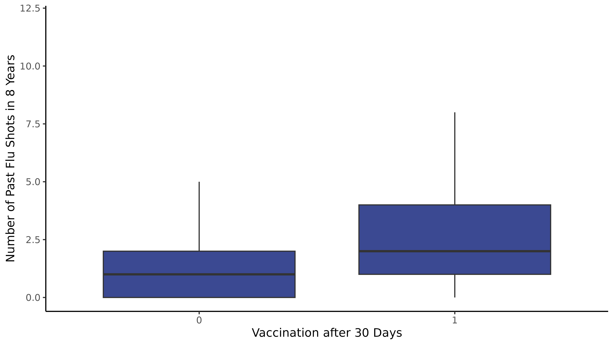

```{r setup, include=FALSE}
knitr::opts_chunk$set(fig.height=4, fig.width=6, warning = F)
if (!require("pacman")) install.packages("pacman")
pacman::p_load(pander)
```

# Executive Summary (1 page)

## Introduction
## Study Goal
## Data Description
## Methodology
## Results

# Detailed Analyses
## Description of Data

Data variables

- `flu_vax_30_days`: whether the patient received a flu vaccination within 30 days of treatment
- `condition`: different text message content sent to the patient to encourage vaccination
- `day_of_text`: which day the text message was sent (1 of 3 days in September 2023)
- `SMS_twice`: whether the patient received a reminder message
- `flu_vax_previous_season`: whether the patient received a flu vaccination in the previous season
- `age`: the patient's age
- `male`: whether the patient is male
- `female`: whether the patient is female (indicator ommitted)
- `insurance`: the type of insurance that a patient has (e.g., Medicare, Medicaid, etc.)
- `prev_flu_vax_count`: the number of flu vaccinations the patient has received in the past 8 years
- `pharm_visits_last_yr`: the number of visits to the partner pharmacy in the last year where the patient made at least one pickup or transaction
- `last_vax_dow_30_min`: the day of week of the patient's last vaccination (rounded to the last 30 minutes)
- `last_vax_time_30_min`: the time of the patient's last vaccination (rounded to the last 30 minutes)
- `timezone`: the patient's timezone

## Exploratory Data Analysis

{width=100%}

{width=100%}

{width=100%}

{width=100%}

{width=100%}

{width=100%}


## Predictive Modeling

I ran each of the models below by using the training set to generate a model, then evaluating the model on the test set to calculate the AUC, misclassification error, and confusion table. 

Then finally, I will pick the best classifier and run it on the validation dataset to see how well it performs.

### OLS w/ Classifier

Notes:
* Used an OLS regression model to predict the probability of receiving a flu vaccination within 30 days of treatment.
* Used a threshold of 50% to calculate the predicted class (vaccination 30 days after treatment or not)


```{r}
confusion_table <- structure(c(180113L, 0L, 24031L, 4L), dim = c(2L, 2L), dimnames = list(
Predicted = c("0", "1"), Actual = c("0", "1")), class = "table")

auc_ols <- 0.763

misspecification_error <- 0.117713619530929

```

### Logistic Regression

Notes:
* Used a threshold of 50% to calculate the predicted class (vaccination 30 days after treatment or not)


```{r}
confusion_table <- structure(c(179014L, 1099L, 23192L, 843L), dim = c(2L, 2L), dimnames = list(Predicted = c("0", "1"), Actual = c("0", "1")), class = "table")

auc_ols <- 0.7624

misspecification_error <- 0.118987205360817

```


### Relaxed LASSO with Logit

```{r}
confusion_table <- structure(c(178570L, 1543L, 22987L, 1048L), dim = c(2L, 2L), dimnames = list(Predicted = c("0", "1"), Actual = c("0", "1")), class = "table")

auc_ols <- 0.7404

misspecification_error <- 0.120157924642906

```

### Relaxed LASSO with OLS

```{r}
confusion_table <- structure(c(180040L, 73L, 23970L, 65L), dim = c(2L, 2L), dimnames = list(Predicted = c("0", "1"), Actual = c("0", "1")), class = "table")

auc_ols <- 0.7444

misspecification_error <- 0.117772400415385

```

### Random Forest

manually tuned the model (because r packages were not available on the secure server)

mtry = 4, ntree = 500

```{r}
confusion_table <- structure(c(179382L, 731L, 235411, 494L), dim = c(2L, 2L), dimnames = list(Predicted = c("0", "1"), Actual = c("0", "1")), class = "table")

auc_ols <- 0.7489

misspecification_error <- 0.118894135627094

```

### Neural Network

Ran a neural net using the nnet package in R
- uses a logistic activation function
- neural network with 1 hidden layer with 10 nodes
- 100 iterations (the most the server could take - it was very slow)

```{r}

confusion_table <- structure(c(180113L, 24035L), dim = 1:2, dimnames = list(Predicted = "0", Actual = c("0", "1")), class = "table")

auc_ols <- 0.7644

misspecification_error <- 0.117733213159081

```


# Conclusions


{width=100%}

OLS and Neural net performed the best on both AUC and misclassification error. Both models essentially predicted that nobody would get vaccinated. In this way, it is interesting that a simple heuristic (guessing that nobody would get vaccinated) would match the performance of the two best models and outperform all the other models. 

Went with OLS as the best model because it was the most **interpretable** and was tied for the best AUC and misclassification error.

Hints that predictions are largely not dependent on model choice - could imply that we don't have good enough data features to be able to improve on our prediction (not a function of non-linearity or model-free approaches), and not good enough data features to be able to differentiate and distinguish between those who will and will not get vaccinated within 30 days. 

Testing our model on the hold-out 20% validation set results below yields errors consistent with our testing errors. 

```{r}
confusion_table <- structure(c(172345L, 4L, 23217L, 2L), dim = c(2L, 2L), dimnames = list(
Predicted = c("0", "1"), Actual = c("0", "1")), class = "table")

auc_ols <- 0.7621

misspecification_error <- 0.118736194060378

```
