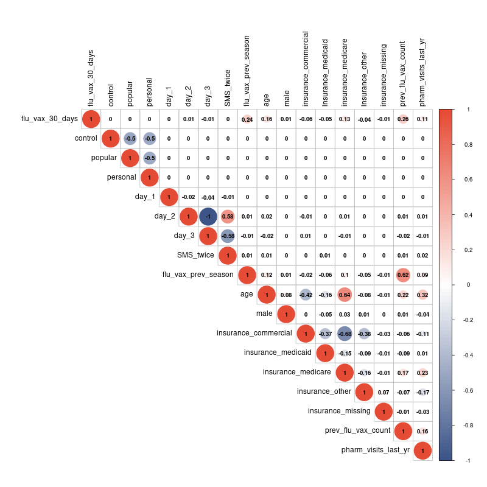

```{r setup, include=FALSE}
knitr::opts_chunk$set(fig.height=4, fig.width=6, warning = F)
if (!require("pacman")) install.packages("pacman")
pacman::p_load(pander)
```

# Executive Summary (1 page)

## Introduction
## Study Goal
## Data Description
## Methodology
## Results

# Detailed Analyses
## Description of Data

Data variables

- `flu_vax_30_days`: whether the patient received a flu vaccination within 30 days of treatment
- `control`: whether the patient received a text message recommendation to get vaccinated without providing a day of week and time (indicator ommitted)
- `popular`: whether the patient received a text message recommendation to get vaccinated at a day of week and time that is popular among all patients
- `personal`: whether the patient received a text message recommendation to get vaccinated at the day of week and time of their last vaccination
- `day_0`: the day of the first text message send
- `day_1`: the day of the second text message send
- `day_2`: the day of the third text message send (indicator ommitted)
- `SMS_twice`: whether the patient received two text messages
- `flu_vax_previous_season`: whether the patient received a flu vaccination in the previous season
- `age`: the patient's age
- `male`: whether the patient is male
- `female`: whether the patient is female (indicator ommitted)
- `insurance_medicaid`: whether the patient has Medicaid insurance
- `insurance_medicare`: whether the patient has Medicare insurance
- `insurance_commercial`: whether the patient has commercial insurance (indicator ommitted)
- `insurance_other`: whether the patient has other insurance
- `prev_flu_vax_count`: the number of flu vaccinations the patient has received in the past 8 years
- `pharm_visits_last_yr`: the number of visits to the partner pharmacy in the last year where the patient made at least one pickup or transaction
- `last_vax_dow_time_30_min`: the day of week and time of the patient's last vaccination
- `timezone`: the patient's timezone

## Exploratory Data Analysis

{width=100%}

{width=100%}

{width=100%}

{width=100%}

{width=100%}

{width=100%}


## Predictive Modeling
## Conclusions

# Appendix
## ChatGPT Usage
## Additional Appendix Slides

