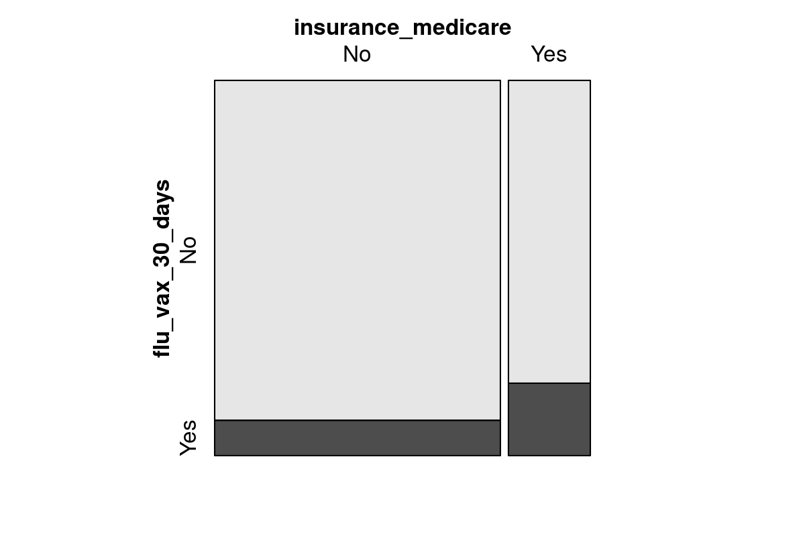

```{r setup, include=FALSE}
knitr::opts_chunk$set(fig.height=4, fig.width=6, warning = F)
if (!require("pacman")) install.packages("pacman")
pacman::p_load(pander)
```

# Executive Summary (1 page)

## Introduction
## Study Goal
## Data Description
## Methodology
## Results

# Detailed Analyses
## Description of Data

Data variables

- `flu_vax_30_days`: whether the patient received a flu vaccination within 30 days of treatment
- `condition`: different text message content sent to the patient to encourage vaccination
- `day_of_text`: which day the text message was sent (1 of 3 days in September 2023)
- `SMS_twice`: whether the patient received a reminder message
- `flu_vax_previous_season`: whether the patient received a flu vaccination in the previous season
- `age`: the patient's age
- `male`: whether the patient is male
- `female`: whether the patient is female (indicator ommitted)
- `insurance`: the type of insurance that a patient has (e.g., Medicare, Medicaid, etc.)
- `prev_flu_vax_count`: the number of flu vaccinations the patient has received in the past 8 years
- `pharm_visits_last_yr`: the number of visits to the partner pharmacy in the last year where the patient made at least one pickup or transaction
- `last_vax_dow_30_min`: the day of week of the patient's last vaccination (rounded to the last 30 minutes)
- `last_vax_time_30_min`: the time of the patient's last vaccination (rounded to the last 30 minutes)
- `timezone`: the patient's timezone

## Exploratory Data Analysis

{width=100%}

{width=100%}

{width=100%}

{width=100%}

{width=100%}

{width=100%}


## Predictive Modeling

<!-- I ran each of the models below by using the training set to generate a model, then evaluating the model on the validation test set to calculate the AUC, misclassification error, and confusion table.  -->

<!-- Then finally, I will pick the best classifier and run it on the held-out test dataset to see how well it performs. -->

### OLS w/ Classifier

<!-- Notes: -->
<!-- * Used an OLS regression model to predict the probability of receiving a flu vaccination within 30 days of treatment. -->
<!-- * Used a threshold of 50% to calculate the predicted class (vaccination 30 days after treatment or not) -->


```{r}
confusion_table <- structure(c(180113L, 0L, 24031L, 4L), dim = c(2L, 2L), dimnames = list(
Predicted = c("0", "1"), Actual = c("0", "1")), class = "table")

auc_ols <- 0.763

misspecification_error <- 0.117713619530929

# Anova Table (Type II tests)
# 
# Response: flu_vax_30_days
#                      Sum Sq     Df    F value                Pr(>F)    
# condition                 1      2     4.8966              0.007472 ** 
# day_of_text               1      2     6.3605              0.001729 ** 
# SMS_twice                 3      1    33.6368        0.000000006646 ***
# flu_vax_prev_season     844      1  9149.6384 < 0.00000000000000022 ***
# age                     139      1  1508.5663 < 0.00000000000000022 ***
# male                      0      1     4.0490              0.044197 *  
# insurance                58      3   208.8539 < 0.00000000000000022 ***
# prev_flu_vax_count     1224      1 13257.6052 < 0.00000000000000022 ***
# pharm_visits_last_yr     95      1  1032.1227 < 0.00000000000000022 ***
# last_vax_dow_30_min       4      6     7.3246        0.000000075770 ***
# last_vax_time_30_min     34     47     7.9275 < 0.00000000000000022 ***
# timezone                 14      7    21.8313 < 0.00000000000000022 ***
# Residuals             56519 612371                                     
# ---
# Signif. codes:  0 ‘***’ 0.001 ‘**’ 0.01 ‘*’ 0.05 ‘.’ 0.1 ‘ ’ 1

anova_table <- structure(list(term = c("condition", "day_of_text", "SMS_twice", 
"flu_vax_prev_season", "age", "male", "insurance", "prev_flu_vax_count", 
"pharm_visits_last_yr", "last_vax_dow_30_min", "last_vax_time_30_min", 
"timezone", "Residuals"), sumsq = c(0.903859434460173, 1.17408621393406, 
3.10450880520511, 844.465574065238, 139.233073446558, 0.37370506147272, 
57.8284862367364, 1223.61022980699, 95.2597305523232, 4.05611661665171, 
34.388287980124, 14.104417062088, 56518.7611466897), df = c(2, 
2, 1, 1, 1, 1, 3, 1, 1, 6, 47, 7, 612371), statistic = c(4.89658030811446, 
6.36051051302214, 33.636815863994, 9149.63841322965, 1508.56626524865, 
4.04902969485052, 208.853881594976, 13257.6051710047, 1032.12270181675, 
7.32455364750182, 7.9274713091423, 21.8312741405105, NA), p.value = c(0.00747238424308794, 
0.00172859826688647, 0.0000000066456052001896, 0, 0, 0.0441971785616302, 
0.00000000000000000000000000000000000000000000000000000000000000000000000000000000000000000000000000000000000000000000000000000000000000206213228884106, 
0, 0.000000000000000000000000000000000000000000000000000000000000000000000000000000000000000000000000000000000000000000000000000000000000000000000000000000000000000000000000000000000000000000000000000000000000000000000000000000000289124730455185, 
0.0000000757699509345124, 0.000000000000000000000000000000000000000000000000000329398936418211, 
0.0000000000000000000000000000104764433800374, NA)), class = c("tbl_df", 
"tbl", "data.frame"), row.names = c(NA, -13L), heading = c("Anova Table (Type II tests)\n", 
"Response: flu_vax_30_days"))

# Call:
# lm(formula = flu_vax_30_days ~ ., data = data_train)
# 
# Residuals:
#      Min       1Q   Median       3Q      Max 
# -0.53661 -0.15689 -0.06390 -0.00916  1.05492 
# 
# Coefficients:
#                              Estimate  Std. Error t value             Pr(>|t|)    
# (Intercept)               -0.08393152  0.01913869  -4.385      0.0000115771996 ***
# conditionpopular           0.00239963  0.00095044   2.525             0.011578 *  
# conditionpersonal          0.00272187  0.00095091   2.862             0.004205 ** 
# day_of_textday_2           0.01810163  0.01396938   1.296             0.195042    
# day_of_textday_3           0.01460908  0.01394819   1.047             0.294924    
# SMS_twice                 -0.00832762  0.00143586  -5.800      0.0000000066456 ***
# flu_vax_prev_season        0.09021025  0.00094309  95.654 < 0.0000000000000002 ***
# age                        0.00111520  0.00002871  38.840 < 0.0000000000000002 ***
# male                       0.00159952  0.00079490   2.012             0.044197 *  
# insurancemedicaid         -0.01738238  0.00151773 -11.453 < 0.0000000000000002 ***
# insurancemedicare          0.02429075  0.00121653  19.967 < 0.0000000000000002 ***
# insuranceother            -0.00738966  0.00144196  -5.125      0.0000002980503 ***
# prev_flu_vax_count         0.02980852  0.00025889 115.142 < 0.0000000000000002 ***
# pharm_visits_last_yr       0.00137682  0.00004286  32.127 < 0.0000000000000002 ***
# last_vax_dow_30_minTue    -0.00429565  0.00137480  -3.125             0.001781 ** 
# last_vax_dow_30_minWed    -0.00357908  0.00135266  -2.646             0.008146 ** 
# last_vax_dow_30_minThu    -0.00393253  0.00139452  -2.820             0.004803 ** 
# last_vax_dow_30_minFri     0.00265193  0.00132573   2.000             0.045462 *  
# last_vax_dow_30_minSat    -0.00067518  0.00153794  -0.439             0.660651    
# last_vax_dow_30_minSun    -0.00358545  0.00166354  -2.155             0.031138 *  
# last_vax_time_30_min12:30 -0.00946205  0.00230452  -4.106      0.0000402843662 ***
# last_vax_time_30_min13:00 -0.01573769  0.00234059  -6.724      0.0000000000177 ***
# last_vax_time_30_min13:30 -0.01802064  0.00312964  -5.758      0.0000000085126 ***
# last_vax_time_30_min14:00 -0.01717839  0.00300570  -5.715      0.0000000109583 ***
# last_vax_time_30_min14:30 -0.00842862  0.00227585  -3.704             0.000213 ***
# last_vax_time_30_min15:00  0.00461008  0.00206262   2.235             0.025414 *  
# last_vax_time_30_min15:30 -0.00677258  0.00228629  -2.962             0.003054 ** 
# last_vax_time_30_min16:00 -0.00234294  0.00209704  -1.117             0.263883    
# last_vax_time_30_min16:30 -0.01107488  0.00233015  -4.753      0.0000020060820 ***
# last_vax_time_30_min17:00 -0.00395238  0.00216494  -1.826             0.067906 .  
# last_vax_time_30_min17:30 -0.00227394  0.00243869  -0.932             0.351109    
# last_vax_time_30_min18:00 -0.00297757  0.00230828  -1.290             0.197067    
# last_vax_time_30_min18:30 -0.00694743  0.00274453  -2.531             0.011362 *  
# last_vax_time_30_min19:00 -0.00680607  0.00266612  -2.553             0.010686 *  
# last_vax_time_30_min19:30 -0.00850324  0.00373935  -2.274             0.022967 *  
# last_vax_time_30_min20:00 -0.01110624  0.00376352  -2.951             0.003167 ** 
# last_vax_time_30_min20:30 -0.01269978  0.00591362  -2.148             0.031750 *  
# last_vax_time_30_min21:00 -0.00208641  0.00634967  -0.329             0.742470    
# last_vax_time_30_min21:30 -0.00913760  0.00996385  -0.917             0.359104    
# last_vax_time_30_min22:00 -0.01600436  0.01009980  -1.585             0.113053    
# last_vax_time_30_min22:30 -0.04286329  0.01740363  -2.463             0.013782 *  
# last_vax_time_30_min23:00 -0.00827910  0.02008834  -0.412             0.680241    
# last_vax_time_30_min23:30  0.01823494  0.01320573   1.381             0.167330    
# last_vax_time_30_min00:00 -0.02090318  0.04062621  -0.515             0.606886    
# last_vax_time_30_min00:30  0.05161564  0.04635462   1.113             0.265496    
# last_vax_time_30_min01:00 -0.03088376  0.03687369  -0.838             0.402281    
# last_vax_time_30_min01:30 -0.05397495  0.05372677  -1.005             0.315081    
# last_vax_time_30_min02:00 -0.05891435  0.04215852  -1.397             0.162279    
# last_vax_time_30_min02:30 -0.03680799  0.05290799  -0.696             0.486618    
# last_vax_time_30_min03:00  0.03413471  0.04531442   0.753             0.451278    
# last_vax_time_30_min03:30 -0.03744867  0.07162402  -0.523             0.601078    
# last_vax_time_30_min04:00 -0.02770937  0.03488238  -0.794             0.426983    
# last_vax_time_30_min04:30 -0.06180430  0.06203255  -0.996             0.319095    
# last_vax_time_30_min05:00  0.00365986  0.02169696   0.169             0.866048    
# last_vax_time_30_min05:30  0.05216242  0.03358321   1.553             0.120369    
# last_vax_time_30_min06:00  0.00692795  0.01543652   0.449             0.653574    
# last_vax_time_30_min06:30 -0.04728100  0.02398958  -1.971             0.048736 *  
# last_vax_time_30_min07:00  0.01704137  0.01123656   1.517             0.129368    
# last_vax_time_30_min07:30  0.00170979  0.01479449   0.116             0.907994    
# last_vax_time_30_min08:00  0.01273762  0.00774572   1.644             0.100079    
# last_vax_time_30_min08:30 -0.01675157  0.00743046  -2.254             0.024168 *  
# last_vax_time_30_min09:00  0.00641036  0.00316328   2.026             0.042715 *  
# last_vax_time_30_min09:30 -0.00726141  0.00345882  -2.099             0.035783 *  
# last_vax_time_30_min10:00  0.01127355  0.00222881   5.058      0.0000004235877 ***
# last_vax_time_30_min10:30 -0.00120714  0.00236023  -0.511             0.609038    
# last_vax_time_30_min11:00  0.00652740  0.00207034   3.153             0.001617 ** 
# last_vax_time_30_min11:30 -0.00787079  0.00229623  -3.428             0.000609 ***
# timezoneUS/Alaska          0.02635143  0.03955868   0.666             0.505325    
# timezoneUS/Arizona         0.04055148  0.01321566   3.068             0.002152 ** 
# timezoneUS/Central         0.02628536  0.01292610   2.034             0.042001 *  
# timezoneUS/Eastern         0.03144182  0.01290000   2.437             0.014796 *  
# timezoneUS/Hawaii          0.05917056  0.01344027   4.402      0.0000107036322 ***
# timezoneUS/Mountain        0.02892279  0.01331688   2.172             0.029864 *  
# timezoneUS/Pacific         0.03815515  0.01293071   2.951             0.003170 ** 
# ---
# Signif. codes:  0 ‘***’ 0.001 ‘**’ 0.01 ‘*’ 0.05 ‘.’ 0.1 ‘ ’ 1
# 
# Residual standard error: 0.3038 on 612371 degrees of freedom
# Multiple R-squared:  0.09954,	Adjusted R-squared:  0.09944 
# F-statistic: 927.3 on 73 and 612371 DF,  p-value: < 0.00000000000000022

tidy_table_ols <- structure(list(term = c("(Intercept)", "conditionpopular", "conditionpersonal", 
"day_of_textday_2", "day_of_textday_3", "SMS_twice", "flu_vax_prev_season", 
"age", "male", "insurancemedicaid", "insurancemedicare", "insuranceother", 
"prev_flu_vax_count", "pharm_visits_last_yr", "last_vax_dow_30_minTue", 
"last_vax_dow_30_minWed", "last_vax_dow_30_minThu", "last_vax_dow_30_minFri", 
"last_vax_dow_30_minSat", "last_vax_dow_30_minSun", "last_vax_time_30_min12:30", 
"last_vax_time_30_min13:00", "last_vax_time_30_min13:30", "last_vax_time_30_min14:00", 
"last_vax_time_30_min14:30", "last_vax_time_30_min15:00", "last_vax_time_30_min15:30", 
"last_vax_time_30_min16:00", "last_vax_time_30_min16:30", "last_vax_time_30_min17:00", 
"last_vax_time_30_min17:30", "last_vax_time_30_min18:00", "last_vax_time_30_min18:30", 
"last_vax_time_30_min19:00", "last_vax_time_30_min19:30", "last_vax_time_30_min20:00", 
"last_vax_time_30_min20:30", "last_vax_time_30_min21:00", "last_vax_time_30_min21:30", 
"last_vax_time_30_min22:00", "last_vax_time_30_min22:30", "last_vax_time_30_min23:00", 
"last_vax_time_30_min23:30", "last_vax_time_30_min00:00", "last_vax_time_30_min00:30", 
"last_vax_time_30_min01:00", "last_vax_time_30_min01:30", "last_vax_time_30_min02:00", 
"last_vax_time_30_min02:30", "last_vax_time_30_min03:00", "last_vax_time_30_min03:30", 
"last_vax_time_30_min04:00", "last_vax_time_30_min04:30", "last_vax_time_30_min05:00", 
"last_vax_time_30_min05:30", "last_vax_time_30_min06:00", "last_vax_time_30_min06:30", 
"last_vax_time_30_min07:00", "last_vax_time_30_min07:30", "last_vax_time_30_min08:00", 
"last_vax_time_30_min08:30", "last_vax_time_30_min09:00", "last_vax_time_30_min09:30", 
"last_vax_time_30_min10:00", "last_vax_time_30_min10:30", "last_vax_time_30_min11:00", 
"last_vax_time_30_min11:30", "timezoneUS/Alaska", "timezoneUS/Arizona", 
"timezoneUS/Central", "timezoneUS/Eastern", "timezoneUS/Hawaii", 
"timezoneUS/Mountain", "timezoneUS/Pacific"), estimate = c(-0.0839315211666577, 
0.00239963238454118, 0.00272187224915724, 0.0181016317187133, 
0.0146090841573671, -0.00832762276960202, 0.0902102496694781, 
0.00111520472723962, 0.00159951691843526, -0.0173823822344676, 
0.0242907545038628, -0.00738966347695505, 0.0298085219145953, 
0.00137682279193479, -0.004295647405898, -0.00357907542366967, 
-0.00393253439326016, 0.0026519343345174, -0.000675179524579105, 
-0.0035854481632851, -0.00946204545208101, -0.0157376940217543, 
-0.018020643646529, -0.0171783947620759, -0.00842862334416177, 
0.00461007957027827, -0.00677258393172685, -0.00234294469672531, 
-0.0110748787199393, -0.00395238291449004, -0.00227393707562796, 
-0.0029775706723509, -0.00694743376621572, -0.00680606756891019, 
-0.00850324142170436, -0.0111062375940188, -0.0126997786646677, 
-0.00208640544485135, -0.00913759845010137, -0.0160043624719913, 
-0.0428632940571411, -0.0082790959944196, 0.0182349427925382, 
-0.0209031807314164, 0.0516156439813631, -0.0308837599542378, 
-0.0539749541083042, -0.058914347707259, -0.0368079888101962, 
0.0341347127198297, -0.0374486677524229, -0.0277093726284209, 
-0.0618042953316898, 0.0036598586281912, 0.0521624249156641, 
0.0069279531441717, -0.0472809969332576, 0.0170413740723981, 
0.0017097919111353, 0.0127376192891963, -0.0167515655987899, 
0.00641035721504984, -0.00726141267388247, 0.0112735458570215, 
-0.00120713508875347, 0.00652739815794711, -0.00787079453575194, 
0.0263514299166764, 0.0405514766691405, 0.0262853600940262, 0.0314418242652108, 
0.0591705649198057, 0.0289227925063726, 0.0381551511498434), 
    std.error = c(0.0191386869423024, 0.000950436543026914, 0.000950906973557952, 
    0.0139693756765458, 0.0139481850794121, 0.00143586498550867, 
    0.000943091692117825, 0.0000287125924006356, 0.000794901574405637, 
    0.00151773372925919, 0.00121652587564976, 0.0014419607489328, 
    0.00025888560405367, 0.0000428560738161648, 0.00137480458427043, 
    0.0013526593792814, 0.0013945209212772, 0.00132572875154153, 
    0.00153794163535411, 0.00166353976588276, 0.00230451512660508, 
    0.00234059038435351, 0.00312963772260785, 0.00300570305678473, 
    0.0022758464174384, 0.00206261891874186, 0.00228628713008073, 
    0.00209704443910995, 0.00233015216922204, 0.00216493537345813, 
    0.00243869336246616, 0.0023082782575546, 0.00274452748244187, 
    0.00266611721422781, 0.00373934748166261, 0.00376351696629469, 
    0.00591361668970875, 0.00634966753596913, 0.00996384758397975, 
    0.0100997979849498, 0.0174036324910206, 0.0200883410802569, 
    0.0132057259100431, 0.0406262093611542, 0.0463546237085105, 
    0.0368736935940258, 0.0537267707229257, 0.0421585166490155, 
    0.0529079945306403, 0.0453144208194033, 0.0716240172891605, 
    0.034882382241663, 0.0620325496310042, 0.0216969585348958, 
    0.0335832085906431, 0.0154365162344505, 0.0239895753620735, 
    0.0112365550264355, 0.0147944856963833, 0.00774572401469749, 
    0.0074304558169236, 0.00316328407943155, 0.00345882371813886, 
    0.00222881265768927, 0.00236023293163161, 0.00207034130829992, 
    0.00229622598540966, 0.0395586809056362, 0.0132156587380457, 
    0.0129260959765259, 0.0129000025473112, 0.0134402665414166, 
    0.0133168835064187, 0.0129307104232528), statistic = c(-4.38543780039283, 
    2.5247686467304, 2.86239592814529, 1.29580821203809, 1.04738244253229, 
    -5.79972549901821, 95.6537422855461, 38.8402660295812, 2.01222009106127, 
    -11.4528536194237, 19.9673142923399, -5.12473275186177, 115.141674345151, 
    32.1266665220151, -3.12455126717341, -2.6459546863683, -2.81998952705453, 
    2.000359674959, -0.439015050414214, -2.15531256710445, -4.1058725728653, 
    -6.72381384071232, -5.75806059479396, -5.71526675707347, 
    -3.70351148459687, 2.23506122647721, -2.9622630695068, -1.1172603942145, 
    -4.75285642981713, -1.82563551916875, -0.932440753161525, 
    -1.2899530906232, -2.53137700775888, -2.55280132943496, -2.27399070650786, 
    -2.95102631221914, -2.1475485022167, -0.328584990164041, 
    -0.917075293764344, -1.58462203856356, -2.46289354129125, 
    -0.412134379904391, 1.38083607949718, -0.514524516565002, 
    1.1134950486479, -0.837555366551113, -1.0046193616709, -1.39744830677374, 
    -0.695698053512117, 0.753285865792495, -0.522850702456903, 
    -0.794365833057276, -0.996320410805743, 0.168680721876522, 
    1.55322934003981, 0.448802893020009, -1.97089761780472, 1.51660130994829, 
    0.115569540315503, 1.64447109979993, -2.25444656579971, 2.02648799604549, 
    -2.09938790340831, 5.05809486415489, -0.511447439180924, 
    3.15281259750701, -3.42770902592488, 0.666135202524458, 3.06844157169401, 
    2.03351113451123, 2.43735023693964, 4.4024844847734, 2.17188897781016, 
    2.95073896954884), p.value = c(0.0000115771995949744, 0.0115776982391067, 
    0.0042046556943933, 0.195042056548247, 0.294923639522634, 
    0.00000000664560520029883, 0, 0, 0.044197178561104, 0.00000000000000000000000000000229157746832197, 
    0.000000000000000000000000000000000000000000000000000000000000000000000000000000000000000113142544487518, 
    0.000000298050277635546, 0, 0.000000000000000000000000000000000000000000000000000000000000000000000000000000000000000000000000000000000000000000000000000000000000000000000000000000000000000000000000000000000000000000000000000000000000000000000000000000000289124730452518, 
    0.00178084797630272, 0.00814628091157972, 0.00480267593572532, 
    0.0454618801904645, 0.66065078590696, 0.0311377714907198, 
    0.0000402843662082016, 0.0000000000177182832258203, 0.00000000851262829168858, 
    0.0000000109582668874773, 0.000212654209435339, 0.0254136885515858, 
    0.00305398466640096, 0.263883442807062, 0.00000200608195710705, 
    0.0679056685999479, 0.351109159522129, 0.197067432864979, 
    0.011361813565905, 0.0106862833537151, 0.0229668897598222, 
    0.00316731928814255, 0.0317500314419689, 0.74246950713236, 
    0.359103547620548, 0.113052750985206, 0.0137823561724824, 
    0.680241075045826, 0.167329871230811, 0.606885509819158, 
    0.265496310724673, 0.402280796042754, 0.315080567515115, 
    0.162279307511225, 0.486618208800687, 0.451278440047936, 
    0.601078341946582, 0.426982796617933, 0.319094883395524, 
    0.866047838902804, 0.120368871021381, 0.653574010404489, 
    0.0487360372984695, 0.129367890655294, 0.907993742310001, 
    0.100079442488231, 0.02416844046392, 0.0427152341223621, 
    0.0357831283758098, 0.000000423587664258412, 0.609037968368795, 
    0.00161713382341059, 0.000608737498835379, 0.505324936492342, 
    0.00215187798289235, 0.0420013400626135, 0.0147956240585703, 
    0.0000107036321853002, 0.0298644205022832, 0.00317026707127489
    )), row.names = c(NA, -74L), class = c("tbl_df", "tbl", "data.frame"
))
 

```

- The OLS w/ Classifier model used an ordinary least squares (OLS) regression to predict the probability of a patient receiving a flu vaccination within 30 days of treatment. The model predictions were then converted to a binary classification (vaccinated or not) using a 50% probability threshold.

- When evaluated on the test set, the OLS w/ Classifier achieved an AUC of 0.763, indicating moderately strong predictive performance. The misclassification error was 0.118, meaning the model incorrectly predicted the vaccination status for about 11.8% of patients. Looking at the confusion table, the model correctly identified 180,113 patients who did not get vaccinated (true negatives) and 4 patients who did get vaccinated (true positives). However, it misclassified 24,031 vaccinated patients as not vaccinated (false negatives).

### Logistic Regression

Next, we use logistic regression to predict whether an individual will get vaccinated given their covariates. Logistic regression maximizes the probability that the outcome of interest occurs, and we can interpret the output coefficients as probabilities that quantify the effect of each covariate on the log odds of vaccination. We use all available covariates to fit our model, and to make predictions, we use a threshold of 0.5. That is, if the $\hat{y} \geq 0.5$, then we predict that the individual will get vaccinated. Using a threshold of 0.5 is more parsimonious and makes more intuitive sense than using a different threshold would. 

This model obtains an AUC of 0.7624 and a misspecification error of 0.119. Looking into the breakdown of errors, this model correctly predicted that 179,014 individuals would not get vaccinated and that 843 individuals would get vaccinated but incorrectly predicted that 1,099 individuals got vaccinated (false positives) and that 23,192 did not get vaccinated (false negatives). 

Comparing our logistic regression model with our OLS model, we see very similar results of the AUC and misspecification error. However, the OLS regression model outperforms the logistic regression model in both false positives, while the logistic regression model outputs fewer false negatives. Given the close performance of these two models, we may want to consider the interpretability of the models as well as the kinds of mistakes they make to evaluate which model we would prefer. If we want to ensure that we will not be overly optimistic, then we will prefer the model with a lower false positive rate, which in this case is the OLS regression model. Should these vaccination predictions be used to inform vaccine stocking decisions, an inflated estimate could lead to wasted vaccines. On the other hand, if we want to be conservative and not over-predict the number of individuals who would like to get vaccinated, then we would prefer the model with a lower false negative rate, which in this case is the logistic regression model.  


```{r}
confusion_table <- structure(c(179014L, 1099L, 23192L, 843L), dim = c(2L, 2L), dimnames = list(Predicted = c("0", "1"), Actual = c("0", "1")), class = "table")

auc_ols <- 0.7624

misspecification_error <- 0.118987205360817

# Analysis of Deviance Table (Type II tests)
#
# Response: flu_vax_30_days
#                      LR Chisq Df            Pr(>Chisq)    
# condition                10.4  2              0.005478 ** 
# day_of_text              10.8  2              0.004575 ** 
# SMS_twice                28.7  1        0.000000083684 ***
# flu_vax_prev_season   11803.2  1 < 0.00000000000000022 ***
# age                    2122.2  1 < 0.00000000000000022 ***
# male                      1.3  1              0.251818    
# insurance               543.7  3 < 0.00000000000000022 ***
# prev_flu_vax_count     8552.6  1 < 0.00000000000000022 ***
# pharm_visits_last_yr    956.9  1 < 0.00000000000000022 ***
# last_vax_dow_30_min      51.2  6        0.000000002752 ***
# last_vax_time_30_min    381.0 47 < 0.00000000000000022 ***
# timezone                146.4  7 < 0.00000000000000022 ***
# ---
# Signif. codes:  0 ‘***’ 0.001 ‘**’ 0.01 ‘*’ 0.05 ‘.’ 0.1 ‘ ’ 1

anova_logit <- structure(list(term = c("condition", "day_of_text", "SMS_twice", 
"flu_vax_prev_season", "age", "male", "insurance", "prev_flu_vax_count", 
"pharm_visits_last_yr", "last_vax_dow_30_min", "last_vax_time_30_min", 
"timezone"), statistic = c(10.4141011472675, 10.7742399993585, 
28.7188789395732, 11803.1711158916, 2122.24739351572, 1.31319005729165, 
543.701792940323, 8552.553990894, 956.949705625884, 51.1591614704812, 
381.035533727845, 146.417895524297), df = c(2, 2, 1, 1, 1, 1, 
3, 1, 1, 6, 47, 7), p.value = c(0.00547780627125776, 0.00457513075800093, 
0.0000000836839442122, 0, 0, 0.251817889397727, 0.00000000000000000000000000000000000000000000000000000000000000000000000000000000000000000000000000000000000000000000161091560231024, 
0, 0.00000000000000000000000000000000000000000000000000000000000000000000000000000000000000000000000000000000000000000000000000000000000000000000000000000000000000000000000000000000000000000000000000000000000000000409312065009972, 
0.00000000275175519075801, 0.00000000000000000000000000000000000000000000000000000763311730171165, 
0.000000000000000000000000000229335315940528)), class = c("tbl_df", 
"tbl", "data.frame"), row.names = c(NA, -12L), heading = c("Analysis of Deviance Table (Type II tests)\n", 
"Response: flu_vax_30_days"))

# Call:
# glm(formula = flu_vax_30_days ~ ., family = binomial(link = "logit"), 
#     data = data_train)
# 
# Deviance Residuals: 
#     Min       1Q   Median       3Q      Max  
# -1.7288  -0.5196  -0.3350  -0.2531   2.9378  
# 
# Coefficients:
#                             Estimate Std. Error z value             Pr(>|z|)    
# (Intercept)               -4.5135385  0.2190902 -20.601 < 0.0000000000000002 ***
# conditionpopular           0.0262157  0.0103738   2.527             0.011501 *  
# conditionpersonal          0.0311575  0.0103778   3.002             0.002679 ** 
# day_of_textday_2           0.1781063  0.1540049   1.156             0.247477    
# day_of_textday_3           0.1433262  0.1537814   0.932             0.351330    
# SMS_twice                 -0.0837482  0.0156425  -5.354  0.00000008608267824 ***
# flu_vax_prev_season        1.0558086  0.0099485 106.128 < 0.0000000000000002 ***
# age                        0.0152824  0.0003344  45.705 < 0.0000000000000002 ***
# male                       0.0098712  0.0086125   1.146             0.251737    
# insurancemedicaid         -0.3579729  0.0210497 -17.006 < 0.0000000000000002 ***
# insurancemedicare          0.0961440  0.0120477   7.980  0.00000000000000146 ***
# insuranceother            -0.1975187  0.0184325 -10.716 < 0.0000000000000002 ***
# prev_flu_vax_count         0.2111230  0.0022420  94.167 < 0.0000000000000002 ***
# pharm_visits_last_yr       0.0130327  0.0004149  31.408 < 0.0000000000000002 ***
# last_vax_dow_30_minTue    -0.0503999  0.0149588  -3.369             0.000754 ***
# last_vax_dow_30_minWed    -0.0374512  0.0145897  -2.567             0.010259 *  
# last_vax_dow_30_minThu    -0.0451781  0.0151720  -2.978             0.002904 ** 
# last_vax_dow_30_minFri     0.0319459  0.0142191   2.247             0.024660 *  
# last_vax_dow_30_minSat     0.0033004  0.0167195   0.197             0.843518    
# last_vax_dow_30_minSun    -0.0366780  0.0185553  -1.977             0.048077 *  
# last_vax_time_30_min12:30 -0.0963873  0.0246863  -3.904  0.00009442823506137 ***
# last_vax_time_30_min13:00 -0.2138522  0.0272554  -7.846  0.00000000000000429 ***
# last_vax_time_30_min13:30 -0.2037500  0.0364303  -5.593  0.00000002233404937 ***
# last_vax_time_30_min14:00 -0.2031301  0.0353499  -5.746  0.00000000912358034 ***
# last_vax_time_30_min14:30 -0.1009118  0.0247310  -4.080  0.00004496154395168 ***
# last_vax_time_30_min15:00  0.0437890  0.0214170   2.045             0.040895 *  
# last_vax_time_30_min15:30 -0.0672985  0.0244332  -2.754             0.005880 ** 
# last_vax_time_30_min16:00 -0.0180653  0.0222603  -0.812             0.417052    
# last_vax_time_30_min16:30 -0.1098333  0.0255033  -4.307  0.00001657602501281 ***
# last_vax_time_30_min17:00 -0.0340465  0.0234376  -1.453             0.146323    
# last_vax_time_30_min17:30 -0.0038984  0.0265577  -0.147             0.883298    
# last_vax_time_30_min18:00 -0.0219780  0.0254498  -0.864             0.387816    
# last_vax_time_30_min18:30 -0.0591019  0.0308403  -1.916             0.055316 .  
# last_vax_time_30_min19:00 -0.0630399  0.0301721  -2.089             0.036677 *  
# last_vax_time_30_min19:30 -0.0857503  0.0438625  -1.955             0.050585 .  
# last_vax_time_30_min20:00 -0.1144611  0.0438013  -2.613             0.008970 ** 
# last_vax_time_30_min20:30 -0.1513447  0.0711602  -2.127             0.033435 *  
# last_vax_time_30_min21:00  0.0058576  0.0733298   0.080             0.936333    
# last_vax_time_30_min21:30 -0.1134118  0.1243671  -0.912             0.361815    
# last_vax_time_30_min22:00 -0.2040490  0.1273432  -1.602             0.109077    
# last_vax_time_30_min22:30 -0.7027720  0.2656410  -2.646             0.008155 ** 
# last_vax_time_30_min23:00 -0.1159868  0.2638045  -0.440             0.660176    
# last_vax_time_30_min23:30  0.2407051  0.1396131   1.724             0.084692 .  
# last_vax_time_30_min00:00 -1.0511393  1.0174953  -1.033             0.301573    
# last_vax_time_30_min00:30  0.6212349  0.4626430   1.343             0.179338    
# last_vax_time_30_min01:00 -0.9216429  0.7381006  -1.249             0.211786    
# last_vax_time_30_min01:30 -1.0013912  1.0296101  -0.973             0.330756    
# last_vax_time_30_min02:00 -8.7308237 26.4600680  -0.330             0.741428    
# last_vax_time_30_min02:30 -0.9260835  1.0347912  -0.895             0.370815    
# last_vax_time_30_min03:00  0.4945942  0.5456483   0.906             0.364706    
# last_vax_time_30_min03:30 -8.4411680 45.7060656  -0.185             0.853477    
# last_vax_time_30_min04:00 -0.8310641  0.7342770  -1.132             0.257713    
# last_vax_time_30_min04:30 -1.0739518  1.0460260  -1.027             0.304563    
# last_vax_time_30_min05:00  0.0118267  0.2566209   0.046             0.963242    
# last_vax_time_30_min05:30  0.5352337  0.3216259   1.664             0.096082 .  
# last_vax_time_30_min06:00  0.0914734  0.1640880   0.557             0.577209    
# last_vax_time_30_min06:30 -0.6955158  0.3543272  -1.963             0.049656 *  
# last_vax_time_30_min07:00  0.1841892  0.1170499   1.574             0.115581    
# last_vax_time_30_min07:30  0.0331465  0.1734156   0.191             0.848417    
# last_vax_time_30_min08:00  0.1586281  0.0789958   2.008             0.044637 *  
# last_vax_time_30_min08:30 -0.1590450  0.0829193  -1.918             0.055102 .  
# last_vax_time_30_min09:00  0.0711087  0.0331351   2.146             0.031871 *  
# last_vax_time_30_min09:30 -0.0708288  0.0370646  -1.911             0.056010 .  
# last_vax_time_30_min10:00  0.1029908  0.0228073   4.516  0.00000631111293702 ***
# last_vax_time_30_min10:30 -0.0139658  0.0245891  -0.568             0.570058    
# last_vax_time_30_min11:00  0.0559522  0.0213069   2.626             0.008639 ** 
# last_vax_time_30_min11:30 -0.0821079  0.0242561  -3.385             0.000712 ***
# timezoneUS/Alaska          0.3704321  0.4182891   0.886             0.375839    
# timezoneUS/Arizona         0.4706016  0.1565914   3.005             0.002653 ** 
# timezoneUS/Central         0.3214874  0.1539705   2.088             0.036800 *  
# timezoneUS/Eastern         0.3811189  0.1537020   2.480             0.013153 *  
# timezoneUS/Hawaii          0.6360200  0.1582222   4.020  0.00005825006858259 ***
# timezoneUS/Mountain        0.3876352  0.1578086   2.456             0.014035 *  
# timezoneUS/Pacific         0.4548446  0.1540109   2.953             0.003144 ** 
# ---
# Signif. codes:  0 ‘***’ 0.001 ‘**’ 0.01 ‘*’ 0.05 ‘.’ 0.1 ‘ ’ 1
# 
# (Dispersion parameter for binomial family taken to be 1)
# 
#     Null deviance: 439398  on 612444  degrees of freedom
# Residual deviance: 381932  on 612371  degrees of freedom
# AIC: 382080
# 
# Number of Fisher Scoring iterations: 10

summary_logit <- structure(list(term = c("(Intercept)", "conditionpopular", "conditionpersonal", 
"day_of_textday_2", "day_of_textday_3", "SMS_twice", "flu_vax_prev_season", 
"age", "male", "insurancemedicaid", "insurancemedicare", "insuranceother", 
"prev_flu_vax_count", "pharm_visits_last_yr", "last_vax_dow_30_minTue", 
"last_vax_dow_30_minWed", "last_vax_dow_30_minThu", "last_vax_dow_30_minFri", 
"last_vax_dow_30_minSat", "last_vax_dow_30_minSun", "last_vax_time_30_min12:30", 
"last_vax_time_30_min13:00", "last_vax_time_30_min13:30", "last_vax_time_30_min14:00", 
"last_vax_time_30_min14:30", "last_vax_time_30_min15:00", "last_vax_time_30_min15:30", 
"last_vax_time_30_min16:00", "last_vax_time_30_min16:30", "last_vax_time_30_min17:00", 
"last_vax_time_30_min17:30", "last_vax_time_30_min18:00", "last_vax_time_30_min18:30", 
"last_vax_time_30_min19:00", "last_vax_time_30_min19:30", "last_vax_time_30_min20:00", 
"last_vax_time_30_min20:30", "last_vax_time_30_min21:00", "last_vax_time_30_min21:30", 
"last_vax_time_30_min22:00", "last_vax_time_30_min22:30", "last_vax_time_30_min23:00", 
"last_vax_time_30_min23:30", "last_vax_time_30_min00:00", "last_vax_time_30_min00:30", 
"last_vax_time_30_min01:00", "last_vax_time_30_min01:30", "last_vax_time_30_min02:00", 
"last_vax_time_30_min02:30", "last_vax_time_30_min03:00", "last_vax_time_30_min03:30", 
"last_vax_time_30_min04:00", "last_vax_time_30_min04:30", "last_vax_time_30_min05:00", 
"last_vax_time_30_min05:30", "last_vax_time_30_min06:00", "last_vax_time_30_min06:30", 
"last_vax_time_30_min07:00", "last_vax_time_30_min07:30", "last_vax_time_30_min08:00", 
"last_vax_time_30_min08:30", "last_vax_time_30_min09:00", "last_vax_time_30_min09:30", 
"last_vax_time_30_min10:00", "last_vax_time_30_min10:30", "last_vax_time_30_min11:00", 
"last_vax_time_30_min11:30", "timezoneUS/Alaska", "timezoneUS/Arizona", 
"timezoneUS/Central", "timezoneUS/Eastern", "timezoneUS/Hawaii", 
"timezoneUS/Mountain", "timezoneUS/Pacific"), estimate = c(-4.513538452188, 
0.0262156948610049, 0.0311575158233405, 0.178106332007686, 0.143326211238368, 
-0.0837481914602017, 1.05580855162521, 0.0152824299201438, 0.00987118260367082, 
-0.35797291733124, 0.0961440363130246, -0.197518696886385, 0.211122976716394, 
0.0130327128575301, -0.0503998959028269, -0.0374512406833945, 
-0.0451780820900989, 0.0319458646129102, 0.00330035386998305, 
-0.036678006276854, -0.0963873174561274, -0.213852207562749, 
-0.203749982686256, -0.20313009499351, -0.100911768878987, 0.0437889862599579, 
-0.0672985302051112, -0.0180652846913192, -0.109833293746817, 
-0.0340464816439724, -0.00389840178968882, -0.0219780433974259, 
-0.0591019493595077, -0.0630399370582686, -0.085750341489026, 
-0.114461082337902, -0.151344706273912, 0.00585755905971615, 
-0.113411765857476, -0.204048988345595, -0.70277200868576, -0.115986829176484, 
0.240705146035139, -1.05113933141708, 0.621234946237661, -0.921642938308716, 
-1.00139118988685, -8.73082366603295, -0.926083453911497, 0.494594166291753, 
-8.44116804748622, -0.83106406244632, -1.07395175020891, 0.0118266967539841, 
0.535233725551917, 0.0914734362748679, -0.695515762747741, 0.184189218240953, 
0.0331464600971938, 0.158628084830627, -0.159045003415018, 0.071108737758638, 
-0.0708288144320709, 0.102990836487577, -0.013965770790276, 0.0559521520226405, 
-0.0821079096650719, 0.370432144916874, 0.470601607814045, 0.321487358651258, 
0.381118856372678, 0.636019970996976, 0.387635159380104, 0.454844601548441
), std.error = c(0.219090216156774, 0.0103738159076328, 0.0103777728275994, 
0.154004859723531, 0.153781395030941, 0.0156424906366316, 0.00994846413722891, 
0.000334374589667978, 0.00861253906058295, 0.0210497410103293, 
0.0120476631086235, 0.0184324666237308, 0.00224201592490083, 
0.000414949943001876, 0.0149587780460309, 0.0145897117054278, 
0.0151720123745914, 0.0142190544699406, 0.0167194649130813, 0.018555275230147, 
0.0246863397042205, 0.0272553747009621, 0.0364302785549567, 0.0353499296728569, 
0.0247309547461786, 0.0214169998266169, 0.0244332124894971, 0.022260308741792, 
0.0255033017128388, 0.0234376381328478, 0.0265577251277323, 0.025449789602916, 
0.0308403312160901, 0.0301720815405603, 0.043862494518529, 0.0438013170827113, 
0.0711601543048083, 0.0733297963110138, 0.12436712379022, 0.127343168125888, 
0.265640959799882, 0.26380445445783, 0.139613097992547, 1.01749533319802, 
0.462642951221238, 0.738100637516986, 1.02961009586267, 26.4600679826533, 
1.03479123749223, 0.545648261617201, 45.7060656195705, 0.734276959057334, 
1.04602604777185, 0.256620920191983, 0.321625909333443, 0.164087961284261, 
0.354327230558151, 0.117049887869756, 0.173415645463045, 0.078995818234802, 
0.082919330824252, 0.0331350539676085, 0.0370646088563047, 0.0228073343445905, 
0.0245890643956793, 0.0213069068673514, 0.0242560683595718, 0.418289149054451, 
0.156591437967318, 0.153970507887832, 0.15370196239885, 0.158222193003755, 
0.157808553013405, 0.154010926834077), statistic = c(-20.6012780094126, 
2.52710237914633, 3.00233165062912, 1.15649812822415, 0.932012687292446, 
-5.35389110376581, 106.127793904808, 45.7045193993918, 1.14614082261157, 
-17.0060485378694, 7.98030584406088, -10.7158038540588, 94.1665821244033, 
31.4079157674958, -3.36925220413975, -2.56696235261877, -2.97772510163244, 
2.24669401755542, 0.19739590274811, -1.97668888345363, -3.90447991119755, 
-7.84623986678121, -5.59287468469094, -5.74626588718453, -4.0803830630348, 
2.04459012067308, -2.75438730105753, -0.811546906238682, -4.30663037215786, 
-1.45264132209023, -0.146789748404241, -0.863584483028797, -1.91638503962217, 
-2.0893466356812, -1.95498095651632, -2.61318814047902, -2.12681812950602, 
0.0798796581252247, -0.911911141796411, -1.60235520561165, -2.64557095869247, 
-0.43966971450448, 1.724087134346, -1.03306550617123, 1.34279565828851, 
-1.24866839488065, -0.97259262890951, -0.32996225375372, -0.894947135574727, 
0.906434054835742, -0.184683759869978, -1.13181280196132, -1.02669694745799, 
0.0460862533932788, 1.66414990216792, 0.55746585891455, -1.96291930950985, 
1.57359585381154, 0.191138809930834, 2.00805673484046, -1.91806906585046, 
2.14602752203606, -1.91095539970936, 4.51568933622462, -0.567966741863102, 
2.62601007133401, -3.3850461026043, 0.885588702824928, 3.00528313631212, 
2.0879801142532, 2.47959655442583, 4.01978988486073, 2.45636343517563, 
2.95332682491071), p.value = c(0.000000000000000000000000000000000000000000000000000000000000000000000000000000000000000000000267295335925641, 
0.0115007971314828, 0.00267920115185987, 0.247477464747233, 0.351329968704234, 
0.000000086082678237198, 0, 0, 0.251736888842169, 0.0000000000000000000000000000000000000000000000000000000000000000740680242350488, 
0.00000000000000145971141894909, 0.00000000000000000000000000858085598824222, 
0, 0.00000000000000000000000000000000000000000000000000000000000000000000000000000000000000000000000000000000000000000000000000000000000000000000000000000000000000000000000000000000000000000000000000000000000000000000000157764176294262, 
0.000753724284377244, 0.010259375039981, 0.00290396314054307, 
0.0246595888512064, 0.843517735677975, 0.0480768081386945, 0.0000944282350613705, 
0.00000000000000428696629480651, 0.0000000223340493659897, 0.00000000912358033737166, 
0.0000449615439516844, 0.0408952843031667, 0.00588021375172061, 
0.417051667382635, 0.0000165760250128127, 0.146323366689726, 
0.883297976617368, 0.38781619124547, 0.0553161036409146, 0.0366765312091285, 
0.0505853180429946, 0.00897019070763068, 0.033435197358988, 0.936332968586961, 
0.361815495842325, 0.109077084344245, 0.00815531804513424, 0.660176340497937, 
0.0846921143118364, 0.301573244305294, 0.179338149657082, 0.211786385164135, 
0.330755807559463, 0.741428483411082, 0.370815348062956, 0.364706154562323, 
0.853477084797955, 0.257713144374122, 0.304563187119422, 0.96324150256998, 
0.0960824767121078, 0.577209179201553, 0.0496555506989641, 0.115580912413255, 
0.84841684219883, 0.0446372631094819, 0.0551022542583712, 0.0318707829798658, 
0.056010312704122, 0.00000631111293701856, 0.570057551121467, 
0.00863922611527946, 0.000711663006164775, 0.375839201427055, 
0.00265333730615467, 0.0367996285274261, 0.0131531113163091, 
0.0000582500685825878, 0.014035113565599, 0.00314368938431573
)), row.names = c(NA, -74L), class = c("tbl_df", "tbl", "data.frame"
))


```


### Relaxed LASSO with Logit

In order to more effective compare the OLS and logistic regression models, we also run a relaxed LASSO with logit model. As with the above models, we use a threshold of 0.5 to determine if an individual is predicted to have gotten vaccinated or not. By creating a model that only incorporates the most important variables, we can compare which variables are selected for the OLS versus logistic regression models, which can then inform our evaluation of which model is more suitable for this task. [TODO: selected covariates]

This model achieves an AUC of 0.7404 and a misspecification error of 0.120. It correctly predicts that 178,570 individuals did not get vaccinated and that 1,048 individuals did get vaccinated but incorrectly predicts that 1,543 individuals got vaccinated even though they did not (false positives) and that 22,987 individuals did not get vaccinated when they actually did (false negatives).  Using LASSO slightly decreases accuracy metrics in terms of both the AUC and misspecification error when compared to the logistic regression model. As with the regular OLS and logistic regression models, the relaxed LASSO with OLS model outperforms the relaxed LASSO with logit model. 

```{r}
confusion_table <- structure(c(178570L, 1543L, 22987L, 1048L), dim = c(2L, 2L), dimnames = list(Predicted = c("0", "1"), Actual = c("0", "1")), class = "table")

auc_ols <- 0.7404

misspecification_error <- 0.120157924642906

# Analysis of Deviance Table (Type II tests)
# 
# Response: flu_vax_30_days
#                      LR Chisq Df            Pr(>Chisq)    
# age                    1994.6  1 < 0.00000000000000022 ***
# insurancemedicaid       333.7  1 < 0.00000000000000022 ***
# insurancemedicare       107.4  1 < 0.00000000000000022 ***
# prev_flu_vax_count    26529.6  1 < 0.00000000000000022 ***
# pharm_visits_last_yr    967.2  1 < 0.00000000000000022 ***
# ---
# Signif. codes:  0 ‘***’ 0.001 ‘**’ 0.01 ‘*’ 0.05 ‘.’ 0.1 ‘ ’ 1

anova_relaxed_logit <- structure(list(term = c("age", "insurancemedicaid", "insurancemedicare", 
"prev_flu_vax_count", "pharm_visits_last_yr"), statistic = c(1994.6393391887, 
333.66047399689, 107.382448222488, 26529.633939493, 967.191209305369
), df = c(1, 1, 1, 1, 1), p.value = c(0, 0.0000000000000000000000000000000000000000000000000000000000000000000000000153300772213227, 
0.000000000000000000000000367042859416657, 0, 0.0000000000000000000000000000000000000000000000000000000000000000000000000000000000000000000000000000000000000000000000000000000000000000000000000000000000000000000000000000000000000000000000000000000000000000000243127142677459
)), class = c("tbl_df", "tbl", "data.frame"), row.names = c(NA, 
-5L), heading = c("Analysis of Deviance Table (Type II tests)\n", 
"Response: flu_vax_30_days"))

# Call:
# glm(formula = flu_vax_30_days ~ ., family = binomial(link = "logit"), 
#     data = data_train_subset)
# 
# Deviance Residuals: 
#     Min       1Q   Median       3Q      Max  
# -1.9093  -0.4909  -0.3822  -0.3077   2.7366  
# 
# Coefficients:
#                        Estimate Std. Error z value            Pr(>|z|)    
# (Intercept)          -3.6319059  0.0169563 -214.19 <0.0000000000000002 ***
# age                   0.0144539  0.0003258   44.37 <0.0000000000000002 ***
# insurancemedicaid    -0.3615986  0.0206214  -17.54 <0.0000000000000002 ***
# insurancemedicare     0.1206693  0.0116449   10.36 <0.0000000000000002 ***
# prev_flu_vax_count    0.3186617  0.0019413  164.15 <0.0000000000000002 ***
# pharm_visits_last_yr  0.0128795  0.0004074   31.62 <0.0000000000000002 ***
# ---
# Signif. codes:  0 ‘***’ 0.001 ‘**’ 0.01 ‘*’ 0.05 ‘.’ 0.1 ‘ ’ 1
# 
# (Dispersion parameter for binomial family taken to be 1)
# 
#     Null deviance: 439398  on 612444  degrees of freedom
# Residual deviance: 394978  on 612439  degrees of freedom
# AIC: 394990
# 
# Number of Fisher Scoring iterations: 5

summary_relaxed_logit <- structure(list(term = c("(Intercept)", "age", "insurancemedicaid", 
"insurancemedicare", "prev_flu_vax_count", "pharm_visits_last_yr"
), estimate = c(-3.63190589678547, 0.0144539313878121, -0.361598557347609, 
0.12066933642523, 0.318661695750741, 0.0128795469680042), std.error = c(0.0169563214830645, 
0.00032576830985126, 0.0206213960011907, 0.0116449340786831, 
0.00194132064846032, 0.000407369439173764), statistic = c(-214.191851718128, 
44.3687459790412, -17.5351153397535, 10.3623889675876, 164.146863632999, 
31.6163799477123), p.value = c(0, 0, 0.000000000000000000000000000000000000000000000000000000000000000000007729262111463, 
0.000000000000000000000000367662525501026, 0, 0.00000000000000000000000000000000000000000000000000000000000000000000000000000000000000000000000000000000000000000000000000000000000000000000000000000000000000000000000000000000000000000000000000000000000000000000000000219884068478088
)), row.names = c(NA, -6L), class = c("tbl_df", "tbl", "data.frame"
))


```

### Relaxed LASSO with OLS

```{r}
confusion_table <- structure(c(180040L, 73L, 23970L, 65L), dim = c(2L, 2L), dimnames = list(Predicted = c("0", "1"), Actual = c("0", "1")), class = "table")

auc_ols <- 0.7444

misspecification_error <- 0.117772400415385

```

- The Relaxed Lasso with OLS model first used a relaxed version of the Lasso (least absolute shrinkage and selection operator) regression to select important features, and then fit an OLS regression using those selected variables to predict flu vaccination probabilities. A 50% threshold was applied to classify patients as vaccinated or not based on the predicted probabilities.

- The Relaxed Lasso with OLS achieved an AUC of 0.744 on the test set. The misclassification error was 11.78%. Examining the confusion table, this model correctly predicted 180,040 non-vaccinated patients (true negatives) and 65 vaccinated patients (true positives), while incorrectly classifying 23,970 patients as not vaccinated when they actually were (false negatives) and 73 as vaccinated when they were not (false positives).

### Random Forest

The above models have high false negative rates, which may indicate that linear and logistic regressions cannot fully capture the relationship between the covariates and vaccination propensities. As such, we run a random forest model, which can allow for more flexibility. Our random forest model has mtry = 4, meaning that we split on four randomly selected predictors at each split, and ntree = 500, meaning that our forest consists of 500 trees. We arrived at these hyperparameters via manual tuning as the required R packages for finding the optimal hyperparameters were not available on the secure server.

The random forest model achieves an AUC of 0.7489 and a misspecification error of 0.119. Despite the additional flexibility offered by the random forest model, the AUC is lower and there is no meaningful difference in the misspecification error when compared to those of the OLS and logistic regression models. Considering the confusion matrix, the random forest model correctly predicted that 179,382 individuals were not vaccinated (true negatives) and 494 were vaccinated (true positives) but incorrectly predicted tat 731 individuals were vaccinated when they were not (false positives) and 23,541 individuals were not vaccinated when they were (false negatives). Again, there does not appear to be improvement in the random forest model when compared to the OLS and logistic regression models. 

<!-- manually tuned the model (because r packages were not available on the secure server) -->

<!-- mtry = 4, ntree = 500 -->

```{r}
confusion_table <- structure(c(179382L, 731L, 235411, 494L), dim = c(2L, 2L), dimnames = list(Predicted = c("0", "1"), Actual = c("0", "1")), class = "table")

auc_ols <- 0.7489

misspecification_error <- 0.118894135627094

```

### Neural Network

<!-- Ran a neural net using the nnet package in R -->
<!-- - uses a logistic activation function -->
<!-- - neural network with 1 hidden layer with 10 nodes -->
<!-- - 100 iterations (the most the server could take - it was very slow) -->
<!-- had to use the nnet package instead of Keras, because I could not isntall Python on the secure server -->

The final model that we consider is a neural network with 1 hidden layer of 10 nodes with a logistic activation function and an output layer that uses a sigmoid activation. We can interpret the outputs as the probability that an input individual and their associated covariates has been vaccinated. We implemented our neural network using the nnet package in R, and to train our neural network, we run it over 100 epochs. Due to computational resource constraints, we were not able to tune our hyperparameters or run the neural network for more epochs. Notably, our neural network predicts 0 for every input, suggesting that hyperparameter tuning or a different architecture may be needed to yield more informative results. 

Despite predicting all 0s, the neural network obtains an AUC of 0.7644, which is the highest of all of the models, and a misspecification error of 0.118. Of these predictions, 180,113 are true negatives and 24,035 are false negatives. While the neural network slightly outperforms all of the other models in terms of the AUC, the comparable misspecification error shows that machine learning may not always lead to improvements in performance. Additionally, given the significantly higher resource requirements for running a neural network and the uninformative results, simpler models are likely better suited for this problem. 

<!-- Note: Here is a plot of the neural network architecture: it is a 73-10-1 network with 751 weights. Here is a plot of the architecture: -->

<!-- {width=100%} -->


```{r}


```{r}

confusion_table <- structure(c(180113L, 24035L), dim = 1:2, dimnames = list(Predicted = "0", Actual = c("0", "1")), class = "table")

auc_ols <- 0.7644

misspecification_error <- 0.117733213159081

```


# Conclusions


{width=100%}

OLS and Neural net performed the best on both AUC and misclassification error. Both models essentially predicted that nobody would get vaccinated. In this way, it is interesting that a simple heuristic (guessing that nobody would get vaccinated) would match the performance of the two best models and outperform all the other models. 

Went with OLS as the best model because it was the most **interpretable** and was tied for the best AUC and misclassification error.

Hints that predictions are largely not dependent on model choice - could imply that we don't have good enough data features to be able to improve on our prediction (not a function of non-linearity or model-free approaches), and not good enough data features to be able to differentiate and distinguish between those who will and will not get vaccinated within 30 days. 

Testing our model on the hold-out 20% validation set results below yields errors consistent with our testing errors. 

```{r}
confusion_table <- structure(c(172345L, 4L, 23217L, 2L), dim = c(2L, 2L), dimnames = list(
Predicted = c("0", "1"), Actual = c("0", "1")), class = "table")

auc_ols <- 0.7621

misspecification_error <- 0.118736194060378

```
